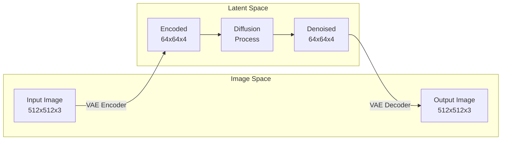
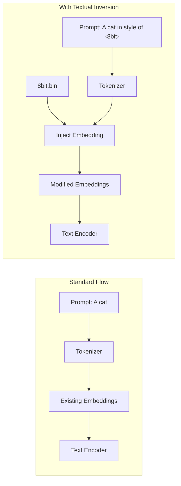
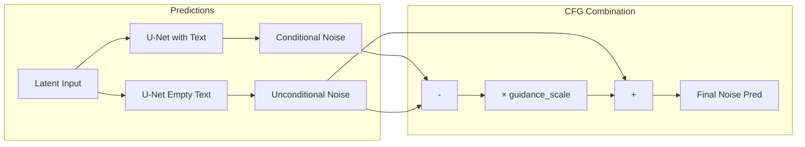
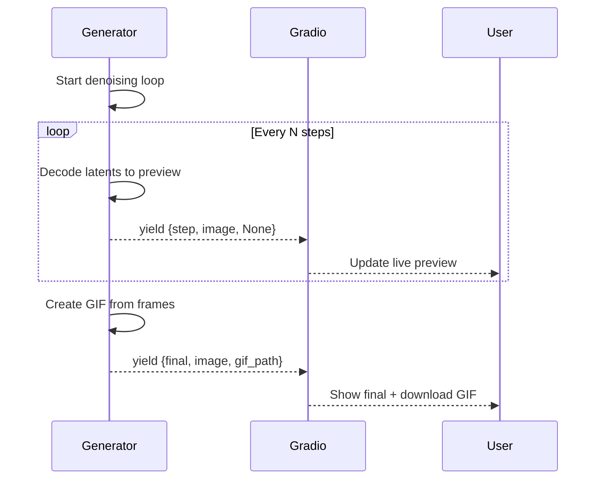
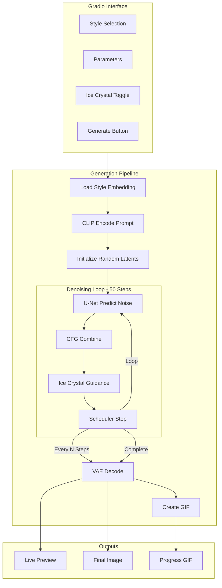
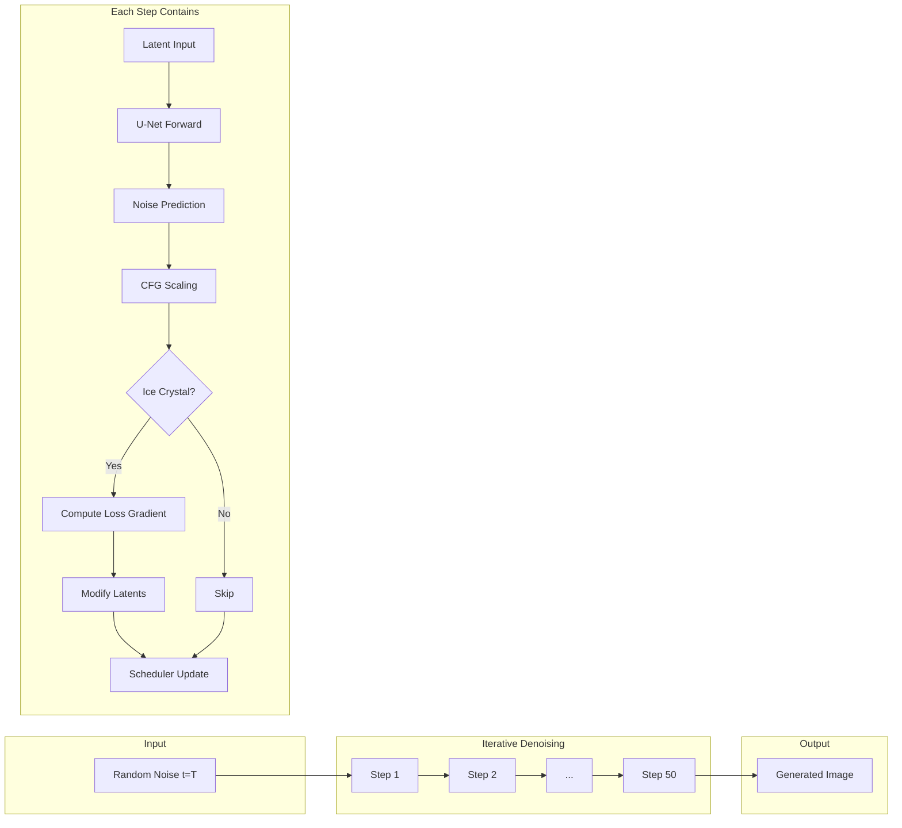
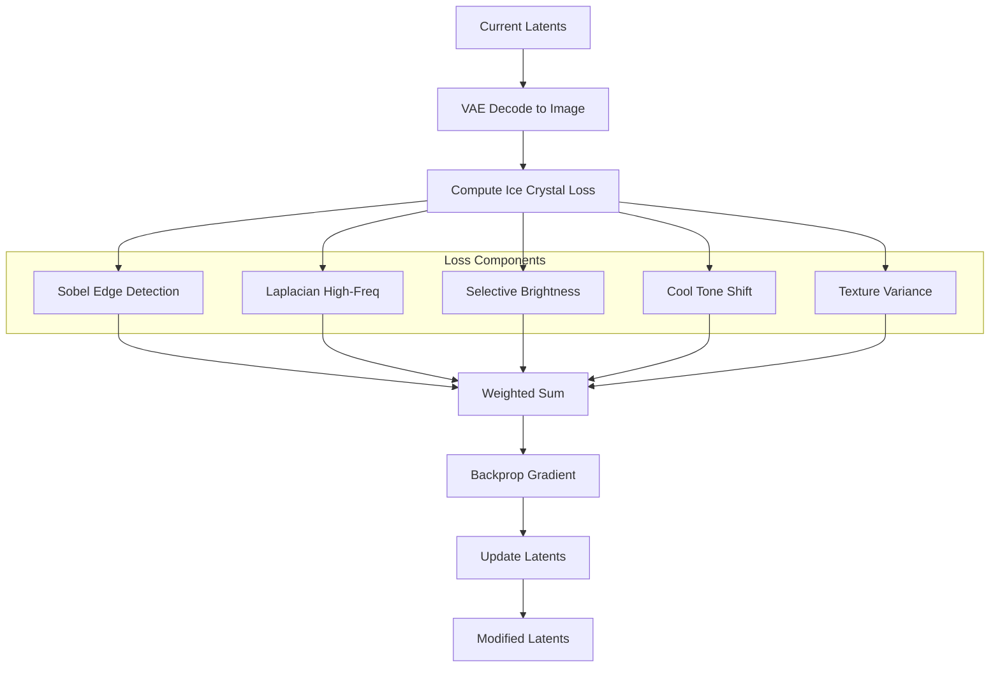
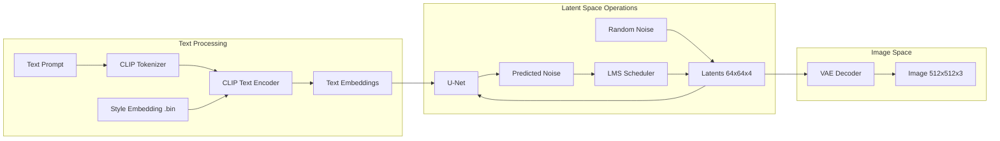
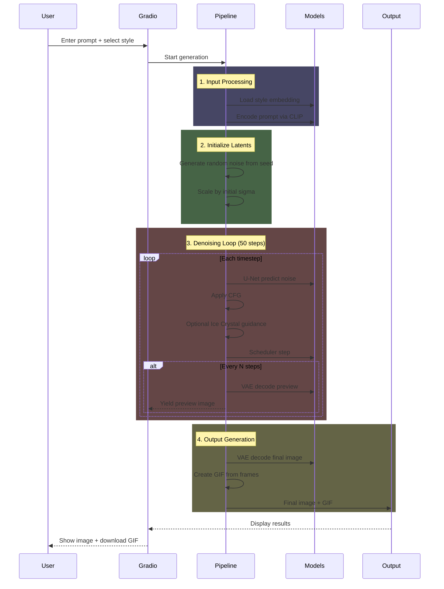

# Multi-Style Image Generator with Ice Crystal Effects

A Hugging Face Spaces application that generates styled images using **Textual Inversion** embeddings with optional **Ice Crystal Guidance** effects. Features live diffusion progress streaming and downloadable GIF animations of the generation process.


---

## Table of Contents

- [Project Summary](#project-summary)
- [Features](#features)
- [Concepts Used](#concepts-used)
- [Design and Architecture](#design-and-architecture)
- [Improvements Made](#improvements-made)
- [Getting Started](#getting-started)
- [References](#references)

---

## Project Summary

This project combines several advanced techniques in generative AI to create a flexible image generation system:

1. **Textual Inversion** - Uses pre-trained style embeddings to generate images in specific artistic styles (8-bit, Dr. Strange, Max Naylor, etc.)

2. **Custom Loss Guidance** - Implements a novel "Ice Crystal" loss function that guides the diffusion process to add crystalline, transparent overlay effects

3. **Live Streaming** - Provides real-time visualization of the diffusion denoising process with intermediate previews

4. **GIF Export** - Automatically creates animated GIFs showing the complete image evolution

The application is designed to run on CPU (Hugging Face free tier) while maintaining reasonable generation times through careful optimization.

---

## Features

| Feature | Description |
|---------|-------------|
| **5 Predefined Styles** | 8bit, ahx_beta, dr_strange, max_naylor, smiling_friend |
| **Custom Style Upload** | Upload your own `.bin` textual inversion embeddings |
| **Ice Crystal Effect** | Optional crystalline overlay with adjustable intensity |
| **Live Preview** | Watch the image evolve during generation |
| **Progress GIF** | Downloadable animated GIF of the diffusion process |
| **Configurable Parameters** | Seed, guidance scale, preview frequency |

---

## Concepts Used

### 1. Latent Diffusion Models (LDM)

The core of this project uses **Stable Diffusion v1.4**, a Latent Diffusion Model that operates in a compressed latent space rather than pixel space.



**Key Components:**

| Component | Purpose | Size |
|-----------|---------|------|
| **VAE** | Compress/decompress images | 512×512 ↔ 64×64 |
| **U-Net** | Predict noise at each step | 860M params |
| **CLIP Text Encoder** | Convert text to embeddings | 77 tokens × 768 dim |
| **LMS Scheduler** | Control denoising trajectory | 50 steps default |

### 2. Textual Inversion

Textual Inversion learns new "words" (embeddings) that represent specific concepts or styles without modifying the model weights.



```python
# Inject learned embedding into the text encoder
style_token = "<my-style>"
style_embedding = torch.load("style_learned_embeds.bin")
text_encoder.get_input_embeddings().weight[token_id] = style_embedding
```

**How it works:**
1. A new token (e.g., `<8bit-style>`) is added to the vocabulary
2. The embedding vector for this token is loaded from a `.bin` file
3. The prompt "A cat in the style of `<8bit-style>`" uses this embedding

### 3. Classifier-Free Guidance (CFG)

CFG improves image quality by combining conditional and unconditional predictions:



```python
noise_pred = noise_pred_uncond + guidance_scale * (noise_pred_text - noise_pred_uncond)
```

| Guidance Scale | Effect |
|----------------|--------|
| `1.0` | Pure unconditional generation |
| `7.5` | Balanced quality/diversity (default) |
| `> 10` | Stronger prompt adherence, less diversity |

### 4. Custom Loss Guidance (Ice Crystal Effect)

A novel technique that modifies latents during generation based on a custom loss function:

```python
# During denoising, compute gradient of custom loss
latents.requires_grad_()
denoised_images = vae.decode(latents_x0)
loss = ice_crystal_loss(denoised_images) * scale
grad = torch.autograd.grad(loss, latents)[0]
latents = latents - grad * sigma**2  # Apply guidance
```

**Ice Crystal Loss Components:**

| Component | Purpose | Weight |
|-----------|---------|--------|
| Edge Detection (Sobel) | Sharp crystalline structures | 3.0 |
| Selective Brightness | Bright edges only | 0.5 |
| High-Frequency (Laplacian) | Fine crystalline details | 0.8 |
| Cool Tones | Subtle blue shift in bright areas | 0.2 |
| Texture Variance | Crystalline texture patterns | 1.0 |

### 5. Streaming Generation with Generators

Python generators enable real-time updates during long-running generation:



```python
def generate_with_style_streaming(...):
    for i, t in enumerate(scheduler.timesteps):
        # ... denoising step ...
        if i % preview_frequency == 0:
            preview = decode_latents_to_image(latents)
            yield {"step": i, "image": preview, "gif": None}
    
    # Final yield with GIF
    yield {"step": total, "image": final, "gif": gif_path}
```

---

## Design and Architecture

### System Architecture



### Denoising Process Detail



### Ice Crystal Guidance Flow



### File Structure

```
project/
├── hf_style_generator.ipynb    # Main notebook for development & deployment
├── app.py                      # Generated Gradio app for HF Spaces
├── requirements.txt            # Python dependencies
├── README.md                   # This file
└── styles/                     # Style embedding files
    ├── 8bit_learned_embeds.bin
    ├── ahx_beta_learned_embeds.bin
    ├── dr_strangelearned_embeds.bin
    ├── max_naylorlearned_embeds.bin
    └── smiling-friend-style_learned_embeds.bin
```

### Model Components



### Data Flow



### Data Flow Summary

| Phase | Description |
|-------|-------------|
| **1. Input Processing** | Load style embedding, inject into text encoder, encode prompt via CLIP |
| **2. Latent Initialization** | Generate random latents from seed, scale by scheduler sigma |
| **3. Iterative Denoising** | 50 steps: U-Net → CFG → Ice Crystal → Scheduler, yield previews |
| **4. Output Generation** | VAE decode final latents, compile frames to GIF |

---

## Improvements Made

### 1. Colab Secrets Integration
```python
# Auto-detect Colab and use secrets
from google.colab import userdata
HF_TOKEN = userdata.get('HF_TOKEN')
login(token=HF_TOKEN)
```

### 2. Auto Username Detection
```python
# No manual username entry required
api = HfApi()
user_info = api.whoami()
HF_USERNAME = user_info["name"]
```

### 3. Robust Model Loading
```python
# Added error handling and dtype optimization
dtype = torch.float16 if device == "cuda" else torch.float32
vae = AutoencoderKL.from_pretrained(model_id, torch_dtype=dtype)
```

### 4. Memory Optimization for CPU
- Float32 precision on CPU for stability
- `torch.no_grad()` contexts to reduce memory
- Explicit cache clearing during ice crystal guidance

### 5. Live Streaming with GIF Export
- Generator-based architecture for real-time updates
- Configurable preview frequency (1-10 steps)
- Automatic GIF creation from intermediate frames

### 6. Transparent Ice Crystal Effect
- Edge-selective brightness (doesn't wash out entire image)
- Texture variance in edge regions
- Subtle cool tones only in bright areas

---

## Getting Started

### Option 1: Run on Google Colab

1. Open `hf_style_generator.ipynb` in Colab
2. Set runtime to **T4 GPU** (Runtime → Change runtime type)
3. Add `HF_TOKEN` secret (key icon in sidebar)
4. Run all cells to deploy to HF Spaces

### Option 2: Local Development

```bash
# Clone and setup
git clone <your-repo>
cd <your-repo>

# Install dependencies
pip install torch diffusers transformers accelerate gradio huggingface_hub Pillow numpy tqdm scipy

# Run locally
python app.py
```

### Option 3: Use Deployed Space

Visit your deployed Hugging Face Space directly at:
```
https://huggingface.co/spaces/<username>/multi-style-generator
```

---

## References

### Papers

| Paper | Description | Link |
|-------|-------------|------|
| **High-Resolution Image Synthesis with Latent Diffusion Models** | The foundational paper for Stable Diffusion | [arXiv:2112.10752](https://arxiv.org/abs/2112.10752) |
| **An Image is Worth One Word: Personalizing Text-to-Image Generation using Textual Inversion** | Textual Inversion technique | [arXiv:2208.01618](https://arxiv.org/abs/2208.01618) |
| **Classifier-Free Diffusion Guidance** | CFG for improved generation quality | [arXiv:2207.12598](https://arxiv.org/abs/2207.12598) |
| **Denoising Diffusion Probabilistic Models** | DDPM fundamentals | [arXiv:2006.11239](https://arxiv.org/abs/2006.11239) |
| **CLIP: Learning Transferable Visual Models From Natural Language Supervision** | CLIP text encoder | [arXiv:2103.00020](https://arxiv.org/abs/2103.00020) |

### Tutorials & Articles

| Resource | Description | Link |
|----------|-------------|------|
| **Hugging Face Diffusers** | Official documentation | [huggingface.co/docs/diffusers](https://huggingface.co/docs/diffusers) |
| **The Illustrated Stable Diffusion** | Visual explanation | [jalammar.github.io](https://jalammar.github.io/illustrated-stable-diffusion/) |
| **Textual Inversion Guide** | HF tutorial | [huggingface.co/docs/diffusers/training/text_inversion](https://huggingface.co/docs/diffusers/training/text_inversion) |
| **Stable Diffusion Deep Dive** | FastAI course | [course.fast.ai](https://course.fast.ai/Lessons/part2.html) |
| **Understanding Latent Space** | VAE explanation | [towardsdatascience.com](https://towardsdatascience.com/understanding-variational-autoencoders-vaes-f70510919f73) |

### Code References

| Repository | Description | Link |
|------------|-------------|------|
| **CompVis/stable-diffusion** | Original SD implementation | [github.com/CompVis/stable-diffusion](https://github.com/CompVis/stable-diffusion) |
| **huggingface/diffusers** | Diffusers library | [github.com/huggingface/diffusers](https://github.com/huggingface/diffusers) |
| **rinongal/textual_inversion** | Original TI implementation | [github.com/rinongal/textual_inversion](https://github.com/rinongal/textual_inversion) |

### Concept Papers for Custom Guidance

| Paper | Relevance | Link |
|-------|-----------|------|
| **Composable Diffusion** | Composing multiple conditions | [arxiv.org/abs/2206.01714](https://arxiv.org/abs/2206.01714) |
| **CLIP Guidance** | Using CLIP for guidance | [arxiv.org/abs/2112.05744](https://arxiv.org/abs/2112.05744) |
| **Universal Guidance** | General guidance framework | [arxiv.org/abs/2302.07121](https://arxiv.org/abs/2302.07121) |

---

## License

This project uses models and libraries with their respective licenses:
- Stable Diffusion: [CreativeML Open RAIL-M](https://huggingface.co/spaces/CompVis/stable-diffusion-license)
- Hugging Face Diffusers: Apache 2.0
- Gradio: Apache 2.0

---

## Acknowledgments

- **Stability AI** and **CompVis** for Stable Diffusion
- **Hugging Face** for Diffusers library and Spaces hosting
- **Textual Inversion** authors for the embedding technique
- Style embedding creators for the predefined styles
