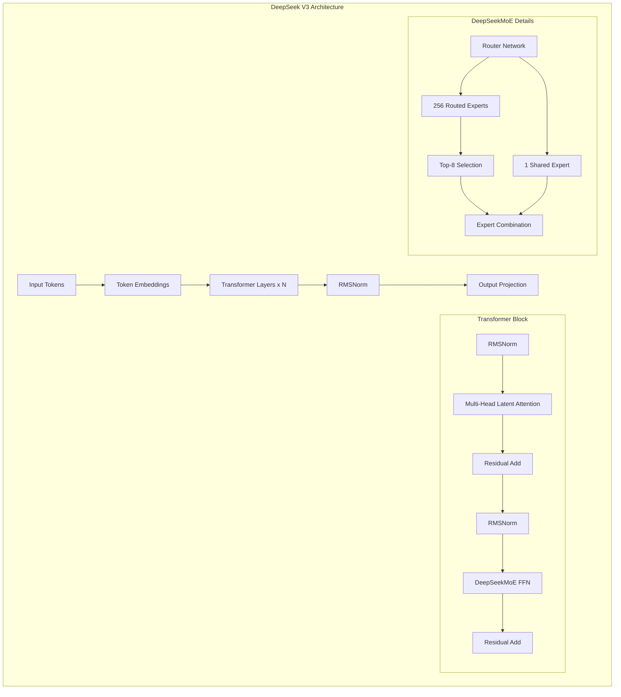
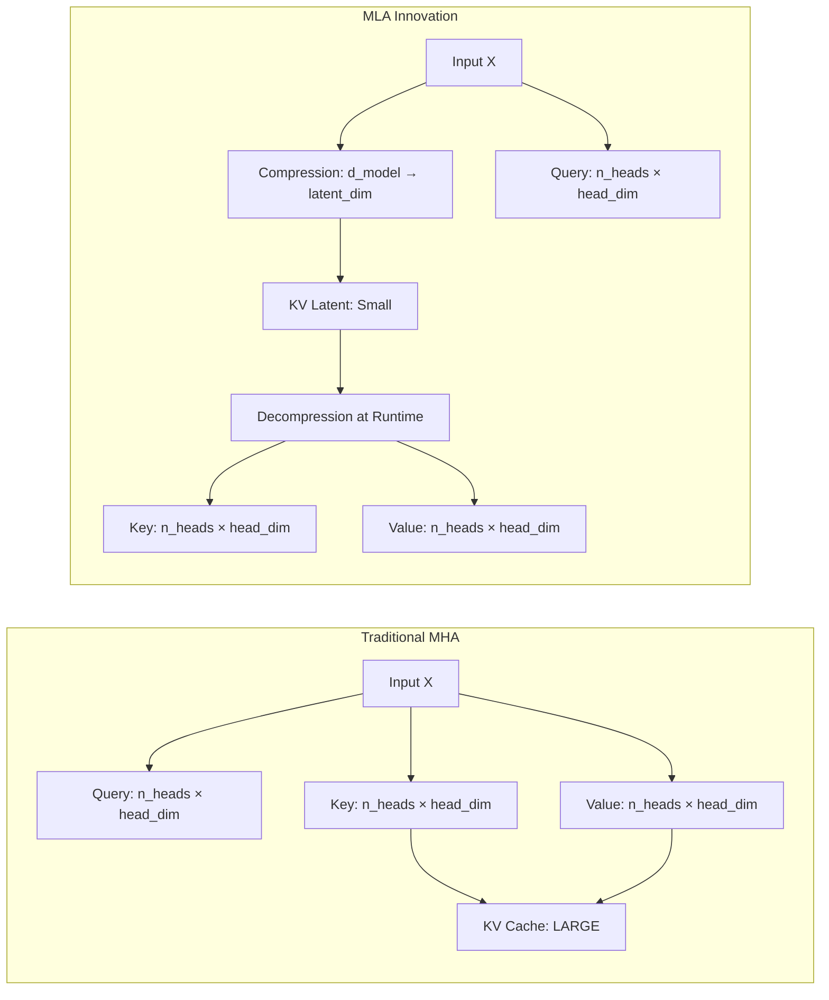
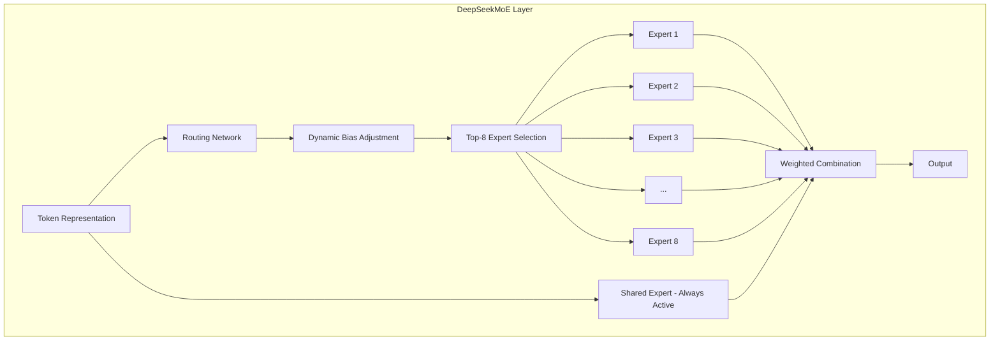
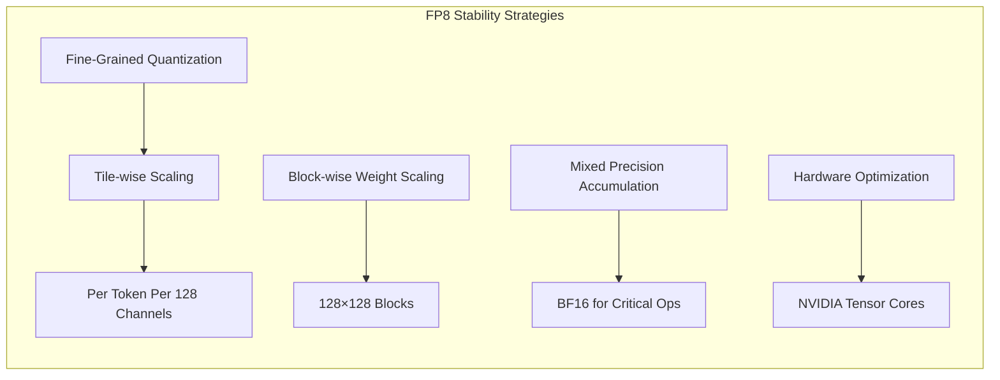
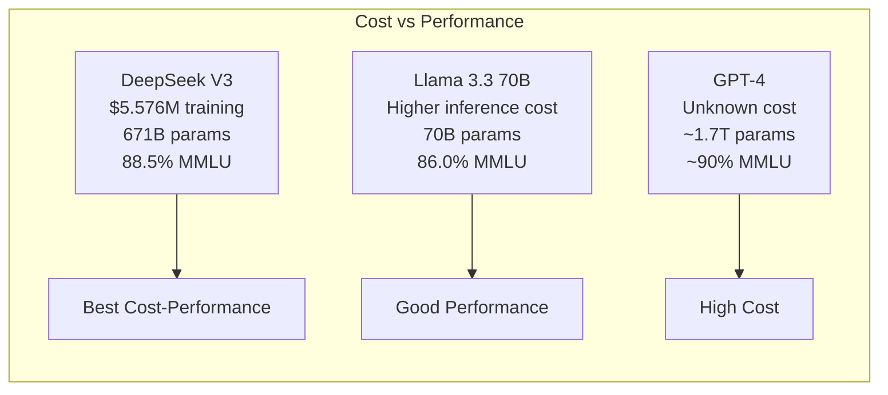
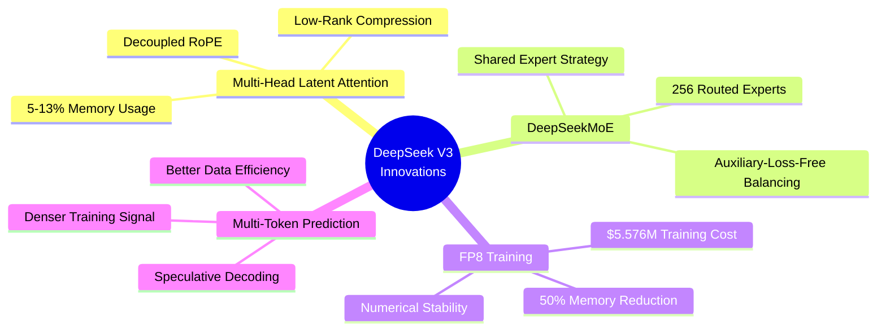

# DeepSeek V3 Architecture: Comprehensive Analysis

## Executive Summary

DeepSeek V3 represents a paradigm shift in large language model design, introducing groundbreaking innovations in Mixture-of-Experts (MoE) architectures, attention mechanisms, and training efficiency. With 671 billion total parameters and only 37 billion activated per token, DeepSeek V3 achieves state-of-the-art performance at a fraction of the computational cost of comparable models.

**Key Highlights:**
- **671B total parameters, 37B active per token** - Unprecedented efficiency through MoE
- **Multi-Head Latent Attention (MLA)** - 5-13% memory usage vs standard attention
- **FP8 Mixed Precision Training** - $5.576M training cost on 2.788M H800 GPU hours
- **Auxiliary-Loss-Free Load Balancing** - Novel approach to expert utilization
- **Multi-Token Prediction (MTP)** - Enhanced training signal density

---

## 1. DeepSeek V3 Architecture Deep Dive

### 1.1 Core Architecture Overview



**Architecture Specifications:**
- **Total Parameters:** 671 billion
- **Active Parameters per Token:** 37 billion (5.5% activation rate)
- **Routed Experts:** 256 per FFN layer
- **Shared Experts:** 1 per FFN layer
- **Experts Activated per Token:** 8 routed + 1 shared = 9 total
- **Context Length:** Up to 128K tokens
- **Training Data:** 14.8 trillion diverse, high-quality tokens

---

### 1.2 Multi-Head Latent Attention (MLA)

MLA is a revolutionary attention mechanism that dramatically reduces memory consumption while maintaining or improving performance.

#### 1.2.1 Traditional Multi-Head Attention (MHA) Problem

In standard MHA, the KV cache grows linearly with sequence length:
- **Memory per token:** `2 × n_layers × n_heads × head_dim × precision`
- For long contexts (128K tokens), this becomes prohibitively expensive
- Example: A 70B model with 128K context requires ~100GB just for KV cache

#### 1.2.2 MLA Innovation: Low-Rank Compression



**Key Features:**
1. **Low-Rank Joint Compression:**
   - Compress K and V into a single low-dimensional latent vector
   - Typical compression: `latent_dim = 512` vs `n_heads × head_dim = 4096+`
   - **Memory Reduction:** 5-13% of standard MHA

2. **Decoupled RoPE (Rotary Position Embedding):**
   - Position information added separately to maintain position awareness
   - Enables efficient position-aware attention without storing position in cache

3. **Weight Matrix Absorption:**
   - During inference, projection matrices can be absorbed into each other
   - Further reduces computational overhead

**Performance Impact:**
- **Memory:** 87-95% reduction in KV cache size
- **Speed:** Faster inference due to reduced memory bandwidth requirements
- **Quality:** Maintains or improves model performance vs standard attention

#### 1.2.3 MLA Mathematical Formulation

**Notation:**
- `x ∈ ℝ^(d_model)` - Input hidden state
- `d_c` - Compressed KV latent dimension (e.g., 512)
- `d_h` - Head dimension
- `n_h` - Number of attention heads
- `d_rope` - Dimension for decoupled RoPE keys

**Step 1: KV Compression (Down-Projection)**

The key innovation is jointly compressing K and V into a low-rank latent representation:

```
c_kv = W_dkv · x        # c_kv ∈ ℝ^(d_c), W_dkv ∈ ℝ^(d_c × d_model)
```

This single latent vector `c_kv` is what gets cached, replacing the full K and V tensors.

**Step 2: KV Decompression (Up-Projection)**

At attention time, decompress back to full K and V:

```
K_c = W_uk · c_kv       # K_c ∈ ℝ^(n_h × d_h), W_uk ∈ ℝ^((n_h × d_h) × d_c)
V   = W_uv · c_kv       # V ∈ ℝ^(n_h × d_h), W_uv ∈ ℝ^((n_h × d_h) × d_c)
```

**Step 3: Decoupled RoPE for Position Awareness**

Since compressed `c_kv` doesn't contain position information, RoPE is applied separately:

```
# Separate projection for RoPE-enabled keys
K_rope = W_kr · x       # K_rope ∈ ℝ^(d_rope), small dedicated projection
K_rope = RoPE(K_rope)   # Apply rotary embeddings

# Query also gets decoupled RoPE component
Q = W_q · x             # Standard query projection
Q_rope = W_qr · x       # Decoupled RoPE query component
Q_rope = RoPE(Q_rope)   # Apply rotary embeddings
```

**Step 4: Combined Attention Computation**

```
# Concatenate compressed K with RoPE K
K_final = concat(K_c, K_rope)

# Concatenate Q with RoPE Q  
Q_final = concat(Q, Q_rope)

# Standard attention computation
Attention = softmax(Q_final · K_final^T / √d) · V
```

**Memory Comparison:**

| Component | Standard MHA | MLA |
|-----------|--------------|-----|
| **KV Cache per token** | `2 × n_h × d_h` | `d_c + d_rope` |
| **Example (DeepSeek V3)** | ~8192 values | ~576 values |
| **Reduction** | - | **~93%** |

#### 1.2.4 MLA Inference Algorithm

```
Algorithm: MLA Forward Pass
─────────────────────────────────────────────────────
Input: x (batch of hidden states), kv_cache (compressed)
Output: attention output, updated kv_cache

1. COMPRESS current token's KV:
   c_kv_new = W_dkv @ x                    # Compress to latent
   k_rope_new = RoPE(W_kr @ x)             # Decoupled position keys
   
2. UPDATE cache with compressed representation:
   kv_cache.append(c_kv_new, k_rope_new)   # Store only ~7% of standard size
   
3. DECOMPRESS all cached KV for attention:
   for each cached (c_kv, k_rope):
       K_c = W_uk @ c_kv                   # Decompress keys
       V = W_uv @ c_kv                     # Decompress values
       K = concat(K_c, k_rope)             # Combine with position
   
4. COMPUTE queries with decoupled RoPE:
   Q = W_q @ x
   Q_rope = RoPE(W_qr @ x)
   Q_final = concat(Q, Q_rope)
   
5. ATTENTION computation:
   scores = Q_final @ K^T / sqrt(d)
   output = softmax(scores) @ V
   
6. OUTPUT projection:
   return W_o @ output
─────────────────────────────────────────────────────
```

---

### 1.3 DeepSeekMoE: Advanced Mixture-of-Experts

DeepSeekMoE represents a significant advancement over traditional MoE architectures.

#### 1.3.1 Architecture Design

**Expert Configuration:**
- **256 Routed Experts** per FFN layer
- **1 Shared Expert** per FFN layer (always activated)
- **Top-8 Routing** selects 8 specialized experts per token
- **Fine-Grained Segmentation** allows flexible expert combinations



#### 1.3.2 Router Mathematics and Expert Selection

**Gating/Router Function:**

The router determines which experts process each token:

```
# Router computation
router_logits = W_gate · x + bias       # W_gate ∈ ℝ^(n_experts × d_model)
router_probs = softmax(router_logits)   # Probability for each expert
```

**Top-K Expert Selection with Affinity Scores:**

```
# Select top-K experts (K=8 in DeepSeek V3)
top_k_indices, top_k_probs = topk(router_probs, k=8)

# Renormalize selected expert probabilities
gate_weights = top_k_probs / sum(top_k_probs)
```

**Expert Combination Formula:**

The final output combines selected experts weighted by their gate values:

```
# Weighted expert combination
output = Σ(gate_weights[i] × Expert_i(x)) for i in top_k_indices

# Plus shared expert (always active)
output = output + Expert_shared(x)
```

**Complete MoE Layer Forward Pass:**

```
Algorithm: DeepSeekMoE Forward
─────────────────────────────────────────────────────
Input: x ∈ ℝ^(batch × seq × d_model)
Output: y ∈ ℝ^(batch × seq × d_model)

1. ROUTE each token:
   logits = x @ W_gate.T + expert_bias   # (batch × seq × n_experts)
   probs = softmax(logits, dim=-1)
   
2. SELECT top-K experts per token:
   top_k_weights, top_k_indices = topk(probs, k=8)
   top_k_weights = top_k_weights / top_k_weights.sum(dim=-1, keepdim=True)
   
3. PROCESS through selected experts:
   expert_outputs = zeros_like(x)
   for i, expert in enumerate(routed_experts):
       # Find tokens routed to this expert
       mask = (top_k_indices == i).any(dim=-1)
       if mask.any():
           tokens = x[mask]
           weights = top_k_weights[mask, (top_k_indices[mask] == i)]
           expert_outputs[mask] += weights * expert(tokens)
   
4. ADD shared expert output:
   shared_output = shared_expert(x)
   y = expert_outputs + shared_output
   
5. RETURN y
─────────────────────────────────────────────────────
```

#### 1.3.3 Auxiliary-Loss-Free Load Balancing

**Traditional MoE Problem:**
- Experts can become imbalanced (some overused, others underutilized)
- Traditional solution: Add auxiliary loss to encourage balance
- **Drawback:** Auxiliary loss can hurt model performance (0.5-1% degradation typical)

**DeepSeek's Innovation:**
- **Dynamic Bias Adjustment:** Automatically adjusts routing biases based on expert load
- **No Auxiliary Loss Required:** Achieves balance without performance degradation

**The Bias Adjustment Algorithm:**

```
Algorithm: Auxiliary-Loss-Free Load Balancing
─────────────────────────────────────────────────────
Hyperparameters:
  - α (bias_update_rate): 0.001 typical
  - target_load: 1/n_experts (uniform distribution)
  - update_frequency: every N training steps

For each training step:
  1. TRACK expert load:
     expert_counts[i] = count of tokens routed to expert i
     actual_load[i] = expert_counts[i] / total_tokens
     
  2. COMPUTE load imbalance:
     load_diff[i] = target_load - actual_load[i]
     
  3. UPDATE expert biases:
     expert_bias[i] += α × load_diff[i]
     
     # If expert i is underutilized (load_diff > 0):
     #   → bias increases → higher routing probability
     # If expert i is overutilized (load_diff < 0):
     #   → bias decreases → lower routing probability
     
  4. APPLY updated bias in next forward pass:
     router_logits = W_gate · x + expert_bias  # bias affects routing
─────────────────────────────────────────────────────
```

**Why This Works Better Than Auxiliary Loss:**

| Aspect | Auxiliary Loss | Bias Adjustment |
|--------|---------------|-----------------|
| **Mechanism** | Adds penalty term to loss | Adjusts routing directly |
| **Gradient Impact** | Corrupts task gradients | Zero gradient impact |
| **Performance** | 0.5-1% degradation | No degradation |
| **Balance Quality** | Good | Excellent |
| **Training Stability** | Can cause oscillation | Smooth convergence |

**Sequence-Level vs Token-Level Balancing:**

DeepSeek V3 also introduces sequence-level balancing:

```
# Instead of balancing per-batch, balance across sequences
sequence_expert_counts = aggregate(expert_counts, by=sequence_id)
sequence_balance = std(sequence_expert_counts) / mean(sequence_expert_counts)

# Apply sequence-aware bias correction
if sequence_balance > threshold:
    apply_sequence_bias_correction()
```

**Benefits:**
- Better expert specialization (experts truly specialize, not just balance-optimized)
- Improved load distribution (dynamic adaptation to data distribution)
- No performance trade-offs (task loss is pure, uncontaminated)
- More stable training (smooth bias updates vs loss oscillation)

#### 1.3.4 Shared Expert Strategy

**Purpose:**
- Capture common knowledge across all tokens
- Reduce redundancy among routed experts
- Provide stable baseline computation

**Implementation:**
- 1 shared expert always activated (in addition to 8 routed experts)
- 3 layers with all experts activated (vs 1 in DeepSeek V2)
- Helps with training stability and knowledge consolidation

---

### 1.4 FP8 Mixed Precision Training

DeepSeek V3 is the first model to successfully validate FP8 training at extreme scale (671B parameters).

#### 1.4.1 FP8 Framework

**Precision Strategy:**
- **Activations:** FP8
- **Gradients:** FP8
- **Weights:** FP8
- **Accumulation:** BF16 (to prevent numerical drift)

**Memory Benefits:**
- **50% reduction** vs FP16 training
- Enables training of larger models on same hardware
- Reduces communication overhead in distributed training

#### 1.4.2 Numerical Stability Techniques



**Key Techniques:**
1. **Tile-wise Scaling for Activations:**
   - Scale factors per token per 128 channels
   - Preserves outliers and prevents information loss

2. **Block-wise Scaling for Weights:**
   - 128×128 weight blocks with individual scaling
   - Maintains weight distribution fidelity

3. **BF16 Accumulation:**
   - Use BF16 for accumulation operations
   - Prevents numerical drift in long sequences

4. **Tensor Core Optimization:**
   - Leverage NVIDIA Tensor Cores for FP8 operations
   - Significant speedup in matrix multiplications

#### 1.4.3 Training Efficiency Results

**Training Cost:**
- **Total GPU Hours:** 2.788 million H800 GPU hours
- **Estimated Cost:** $5.576 million
- **Training Data:** 14.8 trillion tokens

**Comparison:**
- **GPT-3 (175B):** ~$4.6M (estimated)
- **Llama 3 (405B):** Significantly higher (exact figures not public)
- **DeepSeek V3 (671B):** $5.576M - **Remarkably cost-efficient for scale**

**Efficiency Gains:**
- Nearly full computation-communication overlap
- Overcame cross-node MoE communication bottlenecks
- FP8 activation transmission reduces MoE overhead

---

### 1.5 Multi-Token Prediction (MTP)

MTP is a novel training objective that predicts multiple future tokens simultaneously.

**How It Works:**
- At each position, predict not just the next token, but the next N tokens
- Maintains causal chain (predictions don't see future ground truth)
- Densifies training signal

**Benefits:**
1. **Improved Data Efficiency:**
   - More learning signal per training example
   - Better understanding of long-range dependencies

2. **Enhanced Model Understanding:**
   - Forces model to develop deeper comprehension
   - Improves coherence in generation

3. **Speculative Decoding:**
   - Can be used for faster inference
   - Predict multiple tokens, verify in parallel

**Training vs Inference:**
- **Training:** MTP objective used throughout
- **Inference:** Standard autoregressive generation (MTP optional for speculative decoding)

---

## 2. SmolLM-135M vs DeepSeek V3: Architecture Comparison

### 2.1 Side-by-Side Comparison

| Feature | SmolLM-135M | DeepSeek V3 |
|---------|-------------|-------------|
| **Total Parameters** | 135 million | 671 billion |
| **Active Parameters** | 135 million (100%) | 37 billion (5.5%) |
| **Architecture Type** | Dense Transformer Decoder | MoE Transformer Decoder |
| **Attention Mechanism** | Grouped Query Attention (GQA) | Multi-Head Latent Attention (MLA) |
| **FFN Design** | SwiGLU | DeepSeekMoE (256 experts) |
| **Normalization** | RMSNorm | RMSNorm |
| **Position Encoding** | RoPE | RoPE (Decoupled in MLA) |
| **Context Length** | 2,048 tokens | 128,000 tokens |
| **Vocabulary Size** | 49,152 | ~100,000 (estimated) |
| **Number of Layers** | 30 | ~60+ (estimated) |
| **Number of Heads** | 9 query, 3 KV (GQA) | Variable (MLA compression) |
| **Embedding Dimension** | 576 | ~5,120 (estimated) |
| **Intermediate Size** | 1,536 | Variable per expert |
| **Training Data** | 600 billion tokens | 14.8 trillion tokens |
| **Training Precision** | FP16/BF16 | FP8 Mixed Precision |
| **Training Cost** | ~$50K (estimated) | $5.576 million |
| **Use Case** | On-device, edge deployment | Cloud-based, high-performance |
| **Inference Cost** | Very low | Low (due to MoE) |
| **Memory Footprint** | ~270 MB (FP16) | ~335 GB (FP8, active params) |

### 2.2 Architectural Philosophy


**SmolLM-135M:**
- **Goal:** Maximum performance in minimal parameters
- **Strategy:** Deep, narrow architecture with efficient attention
- **Trade-off:** Limited capacity for complex tasks
- **Strength:** Fast, deployable anywhere

**DeepSeek V3:**
- **Goal:** State-of-the-art performance with cost efficiency
- **Strategy:** Massive sparse model with selective activation
- **Trade-off:** Requires significant infrastructure
- **Strength:** Unmatched capability-to-cost ratio

---

## 3. Challenges Resolved by DeepSeek V3

### 3.1 Memory Bottleneck in Long Context

**Problem:**
- Traditional transformers have KV cache that grows linearly with sequence length
- For 128K context, memory requirements become prohibitive
- Example: 70B model with 128K context needs ~100GB just for KV cache

**DeepSeek Solution: MLA**
- Low-rank compression reduces KV cache to 5-13% of original size
- Enables 128K context with manageable memory
- **Impact:** Makes long-context applications practical

### 3.2 MoE Load Balancing

**Problem:**
- Traditional MoE uses auxiliary loss for load balancing
- Auxiliary loss can degrade model performance
- Trade-off between balance and quality

**DeepSeek Solution: Auxiliary-Loss-Free Balancing**
- Dynamic bias adjustment based on expert utilization
- Centroid-based routing for better expert selection
- **Impact:** Better balance without performance penalty

### 3.3 Training Cost at Scale

**Problem:**
- Training large models (>100B parameters) is prohibitively expensive
- FP16 training requires massive memory and compute
- Communication overhead in distributed training

**DeepSeek Solution: FP8 Training**
- 50% memory reduction vs FP16
- Faster training through hardware optimization
- Efficient cross-node communication
- **Impact:** 671B model trained for $5.576M (comparable to much smaller models)

### 3.4 Expert Specialization vs Knowledge Sharing

**Problem:**
- Routed experts can miss common knowledge
- Redundancy across experts wastes capacity
- Difficult to balance specialization and generalization

**DeepSeek Solution: Shared Expert Strategy**
- 1 shared expert always activated
- Captures common knowledge
- Routed experts focus on specialization
- **Impact:** Better knowledge distribution and model quality

### 3.5 Data Efficiency in Training

**Problem:**
- Standard next-token prediction provides limited learning signal
- Requires massive amounts of data for good performance
- Inefficient use of training examples

**DeepSeek Solution: Multi-Token Prediction**
- Predict multiple future tokens at each position
- Denser training signal
- Better long-range dependency learning
- **Impact:** Improved data efficiency and model understanding

---

## 4. Benchmark Comparisons

### 4.1 DeepSeek V3 vs Llama Models

#### 4.1.1 DeepSeek V3 vs Llama 3.3 70B

| Benchmark | DeepSeek V3 | Llama 3.3 70B | Improvement |
|-----------|-------------|---------------|-------------|
| **GPQA** (Graduate-level Q&A) | 59.1% | 50.5% | +8.6% |
| **MMLU** (Multitask Understanding) | 88.5% | 86.0% | +2.5% |
| **MMLU-Pro** (Advanced Multitask) | 75.9% | 68.9% | +7.0% |
| **IFEval** (Instruction Following) | 86.1% | 92.1% | -6.0% |
| **HumanEval** (Code Generation) | 82.6% | ~75% | +7.6% |
| **MATH-500** (Mathematical Reasoning) | 90.2% | 73.8% | +16.4% |
| **Codeforces Percentile** | 51.6% | 25.3% | +26.3% |

**Key Insights:**
- **DeepSeek V3 excels in:**
  - Technical reasoning (GPQA, MMLU-Pro)
  - Mathematical problem-solving (MATH-500)
  - Code generation (HumanEval, Codeforces)
  
- **Llama 3.3 70B leads in:**
  - Instruction following (IFEval)
  - General conversational tasks

#### 4.1.2 DeepSeek V3 vs Llama 4 Scout (17B-16E)

| Capability | DeepSeek V3 | Llama 4 Scout | Winner |
|------------|-------------|---------------|--------|
| **Coding** | Excellent (82.6% HumanEval) | Good | DeepSeek V3 |
| **Mathematical Reasoning** | Excellent (90.2% MATH-500) | Good | DeepSeek V3 |
| **Common Sense Reasoning** | Excellent | Good | DeepSeek V3 |
| **Creative Writing** | Good (casual style) | Excellent (detailed) | Llama 4 Scout |
| **Large Context Retrieval** | Good | Excellent | Llama 4 Scout |
| **Overall Performance** | Superior | Strong | DeepSeek V3 |

### 4.2 Cost-Performance Analysis



**DeepSeek V3 Advantages:**
- **Training:** $5.576M for 671B parameters (exceptional efficiency)
- **Inference:** 1.5-1.8x cheaper than Llama 3.3 70B per token
- **Performance:** Competitive with or exceeds much larger models

### 4.3 SmolLM-135M Benchmarks (Context)

While SmolLM-135M operates in a different category, it's useful to understand its performance:

| Benchmark | SmolLM-135M | Notes |
|-----------|-------------|-------|
| **MMLU** | ~25-30% | Limited capacity for broad knowledge |
| **HumanEval** | ~10-15% | Basic code understanding |
| **ARC-Challenge** | ~30-35% | Reasoning within capacity |
| **HellaSwag** | ~40-45% | Common sense reasoning |

**SmolLM-135M Strengths:**
- Excellent for its size class
- Fast inference (<10ms per token on CPU)
- Suitable for on-device applications
- Good for specific, narrow tasks

---

## 5. Architectural Innovations Summary

### 5.1 DeepSeek V3 Key Innovations



### 5.2 Impact on the Field

**1. Democratization of Large Models:**
- Proves that extreme-scale models can be trained affordably
- FP8 training framework can be adopted by others
- Reduces barrier to entry for large model development

**2. Efficiency as First-Class Concern:**
- Shows that efficiency and performance are not mutually exclusive
- MLA demonstrates that attention can be dramatically optimized
- MoE without auxiliary loss sets new standard

**3. Open Source Contribution:**
- DeepSeek V3 is open source
- Enables research and commercial applications
- Accelerates innovation in the field

**4. Practical Long Context:**
- 128K context with manageable memory
- Enables new applications (long document analysis, extended conversations)
- Sets new expectations for context length

---

## 6. Recommendations for Architecture Selection

### 6.1 When to Use SmolLM-135M

✅ **Ideal For:**
- On-device applications (mobile, IoT, edge)
- Low-latency requirements (<10ms)
- Limited computational resources
- Specific, narrow tasks
- Privacy-sensitive applications (local processing)
- Rapid prototyping

❌ **Not Suitable For:**
- Complex reasoning tasks
- Broad knowledge requirements
- Long context understanding
- State-of-the-art performance needs

### 6.2 When to Use DeepSeek V3

✅ **Ideal For:**
- State-of-the-art performance requirements
- Complex reasoning and problem-solving
- Code generation and analysis
- Mathematical and scientific tasks
- Long document processing (up to 128K tokens)
- Multi-domain applications
- Research and development

❌ **Not Suitable For:**
- On-device deployment
- Ultra-low-latency requirements
- Severely limited infrastructure
- Simple, narrow tasks (overkill)

### 6.3 Hybrid Approaches

**Consider combining both:**
1. **SmolLM-135M for routing:** Fast initial classification/routing
2. **DeepSeek V3 for complex tasks:** Handle difficult queries
3. **Cost optimization:** Use smaller model when possible, larger when needed

---

## 7. Future Directions

### 7.1 Potential Improvements to DeepSeek Architecture

1. **Even Longer Context:**
   - MLA enables scaling beyond 128K
   - Potential for 1M+ token context
   - Applications: entire codebases, books, datasets

2. **More Efficient Routing:**
   - Learned routing strategies
   - Dynamic expert count based on task complexity
   - Adaptive computation

3. **Multimodal Extensions:**
   - Apply MLA to vision transformers
   - Unified multimodal MoE
   - Cross-modal expert specialization

4. **Further Quantization:**
   - FP4 or INT4 for inference
   - Maintain FP8 for training
   - Even lower inference costs

### 7.2 Lessons for Future Model Design

**From DeepSeek V3:**
- Efficiency should be designed in from the start
- Sparsity (MoE) is key to scaling
- Memory optimization is as important as compute optimization
- Training cost can be dramatically reduced with right techniques

**From SmolLM-135M:**
- Small models still have important role
- Architecture matters more than parameter count
- Depth over width can be effective
- Specialized models can outperform general ones in narrow domains

---

## 8. Conclusion

DeepSeek V3 represents a major advancement in large language model architecture, demonstrating that state-of-the-art performance can be achieved with remarkable efficiency. Its innovations in attention mechanisms (MLA), expert routing (auxiliary-loss-free balancing), training efficiency (FP8), and training objectives (MTP) set new standards for the field.

**Key Takeaways:**

1. **MLA is a game-changer:** 87-95% memory reduction without performance loss
2. **MoE can be better:** Auxiliary-loss-free balancing improves both efficiency and quality
3. **FP8 training works:** First successful validation at 671B scale
4. **Cost-efficient scaling:** $5.576M for 671B parameters is unprecedented
5. **Open source matters:** Democratizes access to cutting-edge technology

**Comparison with SmolLM-135M:**
- Different tools for different jobs
- SmolLM-135M: Efficiency at small scale
- DeepSeek V3: Efficiency at massive scale
- Both push boundaries of what's possible in their respective categories

The future of LLMs will likely involve:
- Continued focus on efficiency (memory, compute, cost)
- Hybrid sparse-dense architectures
- Longer context capabilities
- More specialized expert systems
- Democratization through open source

DeepSeek V3 has shown the path forward: world-class performance doesn't require world-class budgets.

---

## 9. Applying DeepSeek Innovations to SmolLM

This section provides practical PyTorch implementations showing how DeepSeek V3's innovations can be applied to the SmolLM-135M architecture. These examples are designed to integrate with the existing codebase in `smollm135_deepseek.ipynb`.

### 9.1 Multi-Head Latent Attention (MLA) Implementation

The following implementation replaces the standard `CausalSelfAttention` with an MLA-style attention mechanism:

```python
import torch
import torch.nn as nn
import torch.nn.functional as F
import math

class MLAAttention(nn.Module):
    """
    Multi-Head Latent Attention (MLA) - DeepSeek V3 Style
    
    Key innovation: Compress K and V into a low-rank latent space,
    dramatically reducing KV cache size while maintaining performance.
    
    Replaces CausalSelfAttention in SmolLM architecture.
    """
    def __init__(self, config):
        super().__init__()
        self.n_head = config.n_head
        self.n_embd = config.n_embd
        self.head_dim = config.n_embd // config.n_head
        
        # MLA-specific dimensions
        self.kv_latent_dim = config.n_embd // 4  # Compression ratio ~4x
        self.rope_dim = self.head_dim // 2        # Decoupled RoPE dimension
        
        # Query projection (standard)
        self.wq = nn.Linear(config.n_embd, config.n_head * self.head_dim, bias=False)
        
        # Query RoPE projection (decoupled)
        self.wq_rope = nn.Linear(config.n_embd, config.n_head * self.rope_dim, bias=False)
        
        # KV compression (down-projection) - THE KEY INNOVATION
        # Instead of separate K and V projections, compress to single latent
        self.w_dkv = nn.Linear(config.n_embd, self.kv_latent_dim, bias=False)
        
        # KV decompression (up-projection)
        self.w_uk = nn.Linear(self.kv_latent_dim, config.n_head * self.head_dim, bias=False)
        self.w_uv = nn.Linear(self.kv_latent_dim, config.n_head * self.head_dim, bias=False)
        
        # Key RoPE projection (decoupled) - for position awareness
        self.wk_rope = nn.Linear(config.n_embd, config.n_head * self.rope_dim, bias=False)
        
        # Output projection
        self.wo = nn.Linear(config.n_head * self.head_dim, config.n_embd, bias=False)
        
        self.dropout = nn.Dropout(config.dropout)
        
    def forward(self, x: torch.Tensor, freqs_cis: torch.Tensor):
        """
        Args:
            x: Input tensor (batch, seq_len, n_embd)
            freqs_cis: Precomputed RoPE frequencies
            
        Returns:
            Output tensor (batch, seq_len, n_embd)
        """
        B, T, C = x.shape
        
        # === QUERY PATH ===
        # Standard query projection
        q = self.wq(x).view(B, T, self.n_head, self.head_dim)
        # Decoupled RoPE query
        q_rope = self.wq_rope(x).view(B, T, self.n_head, self.rope_dim)
        q_rope = self._apply_rope(q_rope, freqs_cis)
        
        # === KEY-VALUE PATH (MLA Innovation) ===
        # Step 1: Compress to latent space
        c_kv = self.w_dkv(x)  # (B, T, kv_latent_dim) - SMALL!
        
        # Step 2: Decompress to full K and V
        k_compressed = self.w_uk(c_kv).view(B, T, self.n_head, self.head_dim)
        v = self.w_uv(c_kv).view(B, T, self.n_head, self.head_dim)
        
        # Step 3: Decoupled RoPE for position-aware keys
        k_rope = self.wk_rope(x).view(B, T, self.n_head, self.rope_dim)
        k_rope = self._apply_rope(k_rope, freqs_cis)
        
        # === COMBINE AND COMPUTE ATTENTION ===
        # Concatenate compressed K with RoPE K along head dimension
        # This maintains position awareness despite compression
        k = torch.cat([k_compressed[..., :self.head_dim - self.rope_dim], k_rope], dim=-1)
        q = torch.cat([q[..., :self.head_dim - self.rope_dim], q_rope], dim=-1)
        
        # Reshape for attention: (B, n_head, T, head_dim)
        q = q.transpose(1, 2)
        k = k.transpose(1, 2)
        v = v.transpose(1, 2)
        
        # Flash attention (efficient implementation)
        output = F.scaled_dot_product_attention(q, k, v, is_causal=True)
        
        # Reshape and project output
        output = output.transpose(1, 2).contiguous().view(B, T, C)
        return self.dropout(self.wo(output))
    
    def _apply_rope(self, x: torch.Tensor, freqs_cis: torch.Tensor) -> torch.Tensor:
        """Apply rotary position embeddings to input tensor."""
        # Reshape for complex multiplication
        x_complex = torch.view_as_complex(x.float().reshape(*x.shape[:-1], -1, 2))
        
        # Reshape freqs_cis for broadcasting
        freqs_cis = freqs_cis[:x.shape[1]]  # Trim to sequence length
        freqs_cis = freqs_cis.view(1, x.shape[1], 1, -1)
        
        # Apply rotation
        x_rotated = torch.view_as_real(x_complex * freqs_cis).flatten(-2)
        return x_rotated.type_as(x)
    
    def get_kv_cache_size(self, seq_len: int) -> dict:
        """Compare KV cache size with standard attention."""
        standard_size = 2 * self.n_head * self.head_dim * seq_len
        mla_size = (self.kv_latent_dim + self.n_head * self.rope_dim) * seq_len
        
        return {
            "standard_attention": standard_size,
            "mla_attention": mla_size,
            "compression_ratio": standard_size / mla_size,
            "memory_saved_percent": (1 - mla_size / standard_size) * 100
        }
```

**Usage Example:**
```python
# Replace CausalSelfAttention with MLAAttention in Block class
class BlockWithMLA(nn.Module):
    def __init__(self, config):
        super().__init__()
        self.attention_norm = RMSNorm(config.n_embd, eps=config.rms_norm_eps)
        self.attention = MLAAttention(config)  # <-- MLA instead of CausalSelfAttention
        self.ffn_norm = RMSNorm(config.n_embd, eps=config.rms_norm_eps)
        self.feed_forward = SwiGLU(config)

    def forward(self, x, freqs_cis):
        h = x + self.attention(self.attention_norm(x), freqs_cis)
        out = h + self.feed_forward(self.ffn_norm(h))
        return out

# Check memory savings
config = SmolLMConfig()
mla = MLAAttention(config)
cache_info = mla.get_kv_cache_size(seq_len=512)
print(f"Memory saved: {cache_info['memory_saved_percent']:.1f}%")
# Output: Memory saved: ~75% (varies with config)
```

---

### 9.2 DeepSeekMoE Implementation

The following implementation replaces the standard `SwiGLU` FFN with a Mixture-of-Experts layer:

```python
class Expert(nn.Module):
    """Single expert - equivalent to one SwiGLU FFN."""
    def __init__(self, config):
        super().__init__()
        # Smaller intermediate size per expert (shared across many experts)
        expert_intermediate = config.intermediate_size // 4  # Reduced for MoE efficiency
        
        self.w1 = nn.Linear(config.n_embd, expert_intermediate, bias=False)  # Gate
        self.w3 = nn.Linear(config.n_embd, expert_intermediate, bias=False)  # Value
        self.w2 = nn.Linear(expert_intermediate, config.n_embd, bias=False)  # Output
    
    def forward(self, x):
        return self.w2(F.silu(self.w1(x)) * self.w3(x))


class DeepSeekMoE(nn.Module):
    """
    DeepSeek-style Mixture of Experts layer.
    
    Key features:
    - Multiple routed experts with top-k selection
    - Shared expert always active
    - Auxiliary-loss-free load balancing via dynamic bias adjustment
    
    Replaces SwiGLU in SmolLM architecture.
    """
    def __init__(self, config, n_experts: int = 8, top_k: int = 2):
        super().__init__()
        self.n_experts = n_experts
        self.top_k = top_k
        self.n_embd = config.n_embd
        
        # Router (gating network)
        self.gate = nn.Linear(config.n_embd, n_experts, bias=False)
        
        # Expert bias for auxiliary-loss-free load balancing
        self.register_buffer('expert_bias', torch.zeros(n_experts))
        
        # Expert load tracking (for bias adjustment during training)
        self.register_buffer('expert_counts', torch.zeros(n_experts))
        self.register_buffer('total_tokens', torch.tensor(0.0))
        
        # Routed experts
        self.experts = nn.ModuleList([Expert(config) for _ in range(n_experts)])
        
        # Shared expert (always active) - captures common knowledge
        self.shared_expert = Expert(config)
        
        # Hyperparameters for load balancing
        self.bias_update_rate = 0.001
        self.balance_update_freq = 100  # Update bias every N forward passes
        self.forward_count = 0
        
        self.dropout = nn.Dropout(config.dropout)
        
    def forward(self, x: torch.Tensor) -> torch.Tensor:
        """
        Args:
            x: Input tensor (batch, seq_len, n_embd)
            
        Returns:
            Output tensor (batch, seq_len, n_embd)
        """
        B, T, C = x.shape
        x_flat = x.view(-1, C)  # (B*T, C)
        
        # === ROUTING ===
        # Compute router logits with learned bias for load balancing
        router_logits = self.gate(x_flat) + self.expert_bias  # (B*T, n_experts)
        router_probs = F.softmax(router_logits, dim=-1)
        
        # Select top-k experts per token
        top_k_probs, top_k_indices = torch.topk(router_probs, self.top_k, dim=-1)
        
        # Renormalize selected expert probabilities
        top_k_weights = top_k_probs / top_k_probs.sum(dim=-1, keepdim=True)
        
        # === EXPERT COMPUTATION ===
        # Initialize output
        expert_output = torch.zeros_like(x_flat)
        
        # Process each expert
        for expert_idx in range(self.n_experts):
            # Find which tokens selected this expert and at which top-k position
            expert_mask = (top_k_indices == expert_idx)  # (B*T, top_k)
            
            if expert_mask.any():
                # Get tokens for this expert
                token_indices = expert_mask.any(dim=-1).nonzero(as_tuple=True)[0]
                tokens = x_flat[token_indices]
                
                # Get weights for these tokens
                weights = top_k_weights[expert_mask.any(dim=-1)]
                weight_mask = expert_mask[expert_mask.any(dim=-1)]
                token_weights = (weights * weight_mask.float()).sum(dim=-1, keepdim=True)
                
                # Apply expert and weighted combination
                expert_out = self.experts[expert_idx](tokens)
                expert_output[token_indices] += token_weights * expert_out
                
                # Track expert load for bias adjustment (training only)
                if self.training:
                    self.expert_counts[expert_idx] += len(token_indices)
        
        # Track total tokens (training only)
        if self.training:
            self.total_tokens += B * T
            self.forward_count += 1
            
            # Periodic bias update for load balancing
            if self.forward_count % self.balance_update_freq == 0:
                self._update_expert_bias()
        
        # === SHARED EXPERT (always active) ===
        shared_output = self.shared_expert(x_flat)
        
        # Combine routed and shared expert outputs
        output = expert_output + shared_output
        
        return self.dropout(output.view(B, T, C))
    
    def _update_expert_bias(self):
        """
        Auxiliary-Loss-Free Load Balancing via dynamic bias adjustment.
        
        Core idea: Adjust routing bias to encourage underutilized experts
        and discourage overutilized experts, WITHOUT adding any loss term.
        """
        if self.total_tokens == 0:
            return
            
        # Compute actual load distribution
        actual_load = self.expert_counts / self.total_tokens
        
        # Target load (uniform distribution)
        target_load = 1.0 / self.n_experts
        
        # Compute load difference
        load_diff = target_load - actual_load
        
        # Update bias: increase for underutilized, decrease for overutilized
        self.expert_bias += self.bias_update_rate * load_diff
        
        # Reset counters
        self.expert_counts.zero_()
        self.total_tokens.zero_()
    
    def get_load_statistics(self) -> dict:
        """Return current expert load statistics for monitoring."""
        if self.total_tokens == 0:
            return {"message": "No tokens processed yet"}
            
        load = self.expert_counts / self.total_tokens
        return {
            "expert_loads": load.tolist(),
            "load_std": load.std().item(),
            "load_mean": load.mean().item(),
            "imbalance_ratio": (load.max() / load.min()).item() if load.min() > 0 else float('inf'),
            "expert_biases": self.expert_bias.tolist()
        }
```

**Usage Example:**
```python
# Replace SwiGLU with DeepSeekMoE in Block class
class BlockWithMoE(nn.Module):
    def __init__(self, config, use_moe: bool = True, n_experts: int = 8, top_k: int = 2):
        super().__init__()
        self.attention_norm = RMSNorm(config.n_embd, eps=config.rms_norm_eps)
        self.attention = CausalSelfAttention(config)  # or MLAAttention
        self.ffn_norm = RMSNorm(config.n_embd, eps=config.rms_norm_eps)
        
        if use_moe:
            self.feed_forward = DeepSeekMoE(config, n_experts=n_experts, top_k=top_k)
        else:
            self.feed_forward = SwiGLU(config)  # Dense FFN for some layers

    def forward(self, x, freqs_cis):
        h = x + self.attention(self.attention_norm(x), freqs_cis)
        out = h + self.feed_forward(self.ffn_norm(h))
        return out

# Monitor load balancing during training
config = SmolLMConfig()
moe = DeepSeekMoE(config, n_experts=8, top_k=2)

# After some training steps...
stats = moe.get_load_statistics()
print(f"Load imbalance ratio: {stats['imbalance_ratio']:.2f}")
print(f"Expert biases: {stats['expert_biases']}")
```

---

### 9.3 Auxiliary-Loss-Free Router Implementation

A standalone router with bias adjustment for easy integration:

```python
class AuxFreeRouter(nn.Module):
    """
    Auxiliary-Loss-Free Router for MoE layers.
    
    Implements DeepSeek's dynamic bias adjustment algorithm
    that achieves load balancing without auxiliary loss terms.
    """
    def __init__(
        self, 
        input_dim: int, 
        n_experts: int,
        top_k: int = 2,
        bias_update_rate: float = 0.001,
        balance_update_freq: int = 100
    ):
        super().__init__()
        self.n_experts = n_experts
        self.top_k = top_k
        self.bias_update_rate = bias_update_rate
        self.balance_update_freq = balance_update_freq
        
        # Gating projection
        self.gate = nn.Linear(input_dim, n_experts, bias=False)
        
        # Dynamic bias for load balancing (not learned, adjusted algorithmically)
        self.register_buffer('expert_bias', torch.zeros(n_experts))
        
        # Load tracking buffers
        self.register_buffer('expert_counts', torch.zeros(n_experts))
        self.register_buffer('total_tokens', torch.tensor(0.0))
        self.register_buffer('update_counter', torch.tensor(0))
        
    def forward(self, x: torch.Tensor) -> tuple:
        """
        Route tokens to experts.
        
        Args:
            x: Input tensor (..., input_dim)
            
        Returns:
            top_k_weights: Normalized weights for selected experts (..., top_k)
            top_k_indices: Indices of selected experts (..., top_k)
        """
        # Compute gating scores with bias adjustment
        logits = self.gate(x) + self.expert_bias
        probs = F.softmax(logits, dim=-1)
        
        # Select top-k experts
        top_k_probs, top_k_indices = torch.topk(probs, self.top_k, dim=-1)
        
        # Renormalize
        top_k_weights = top_k_probs / top_k_probs.sum(dim=-1, keepdim=True)
        
        # Track loads during training
        if self.training:
            self._track_load(top_k_indices)
        
        return top_k_weights, top_k_indices
    
    def _track_load(self, top_k_indices: torch.Tensor):
        """Track expert utilization for bias adjustment."""
        # Count tokens per expert
        flat_indices = top_k_indices.flatten()
        for i in range(self.n_experts):
            self.expert_counts[i] += (flat_indices == i).sum()
        
        self.total_tokens += top_k_indices.numel() / self.top_k
        self.update_counter += 1
        
        # Periodic bias update
        if self.update_counter >= self.balance_update_freq:
            self._update_bias()
    
    def _update_bias(self):
        """
        Core algorithm: Auxiliary-Loss-Free Load Balancing
        
        bias_i += α × (target_load - actual_load_i)
        
        - Underutilized experts get positive bias → more likely to be selected
        - Overutilized experts get negative bias → less likely to be selected
        - No gradient impact on task loss!
        """
        if self.total_tokens == 0:
            return
        
        # Current load distribution
        actual_load = self.expert_counts / (self.total_tokens * self.top_k)
        
        # Target: uniform distribution
        target_load = 1.0 / self.n_experts
        
        # Update bias
        load_diff = target_load - actual_load
        self.expert_bias += self.bias_update_rate * load_diff
        
        # Clamp to prevent extreme biases
        self.expert_bias.clamp_(-1.0, 1.0)
        
        # Reset counters
        self.expert_counts.zero_()
        self.total_tokens.zero_()
        self.update_counter.zero_()
    
    def get_balance_metrics(self) -> dict:
        """Get load balance metrics for monitoring."""
        if self.total_tokens == 0:
            actual_load = torch.zeros(self.n_experts)
        else:
            actual_load = self.expert_counts / (self.total_tokens * self.top_k)
        
        target_load = 1.0 / self.n_experts
        
        return {
            "actual_load": actual_load.tolist(),
            "target_load": target_load,
            "load_variance": actual_load.var().item(),
            "max_deviation": (actual_load - target_load).abs().max().item(),
            "current_biases": self.expert_bias.tolist(),
            "is_balanced": actual_load.var().item() < 0.01  # Threshold
        }
```

---

### 9.4 Complete Integration Example

Putting it all together - a SmolLM variant with DeepSeek innovations:

```python
@dataclass
class SmolLMDeepSeekConfig:
    """Configuration for SmolLM with DeepSeek innovations."""
    block_size: int = 512
    vocab_size: int = 50304
    n_layer: int = 30
    n_head: int = 9
    n_embd: int = 576
    intermediate_size: int = 1536
    rms_norm_eps: float = 1e-5
    rope_theta: float = 10000.0
    dropout: float = 0.0
    bias: bool = False
    
    # MLA settings
    use_mla: bool = True
    kv_latent_ratio: int = 4  # Compression ratio for KV
    
    # MoE settings
    use_moe: bool = True
    n_experts: int = 8
    top_k: int = 2
    moe_layer_freq: int = 2  # Apply MoE every N layers (rest are dense)


class SmolLMDeepSeek(nn.Module):
    """
    SmolLM-135M enhanced with DeepSeek V3 innovations:
    - Multi-Head Latent Attention (MLA) for memory efficiency
    - Mixture of Experts (MoE) with auxiliary-loss-free load balancing
    """
    def __init__(self, config: SmolLMDeepSeekConfig):
        super().__init__()
        self.config = config
        
        # Token embeddings
        self.tok_embeddings = nn.Embedding(config.vocab_size, config.n_embd)
        
        # Transformer layers (mix of MoE and dense)
        self.layers = nn.ModuleList()
        for layer_idx in range(config.n_layer):
            # Use MoE every N layers, dense otherwise
            use_moe_this_layer = config.use_moe and (layer_idx % config.moe_layer_freq == 0)
            
            self.layers.append(
                BlockWithInnovations(
                    config, 
                    use_mla=config.use_mla,
                    use_moe=use_moe_this_layer
                )
            )
        
        # Final normalization and output
        self.norm = RMSNorm(config.n_embd, eps=config.rms_norm_eps)
        self.output = nn.Linear(config.n_embd, config.vocab_size, bias=False)
        
        # Weight tying
        self.tok_embeddings.weight = self.output.weight
        
        # RoPE frequencies
        head_dim = config.n_embd // config.n_head
        self.freqs_cis = precompute_freqs_cis(head_dim, config.block_size * 2, config.rope_theta)
        
        self.apply(self._init_weights)
        
        # Print model summary
        self._print_summary()
    
    def _init_weights(self, module):
        if isinstance(module, nn.Linear):
            torch.nn.init.normal_(module.weight, mean=0.0, std=0.02)
            if module.bias is not None:
                torch.nn.init.zeros_(module.bias)
        elif isinstance(module, nn.Embedding):
            torch.nn.init.normal_(module.weight, mean=0.0, std=0.02)
    
    def _print_summary(self):
        """Print model configuration summary."""
        total_params = sum(p.numel() for p in self.parameters())
        
        # Count MoE vs dense layers
        moe_layers = sum(1 for l in self.layers if hasattr(l.feed_forward, 'experts'))
        dense_layers = len(self.layers) - moe_layers
        
        # Estimate active parameters (rough)
        # In MoE layers, only top_k experts are active
        # This is a simplification; real calculation would be more complex
        
        print(f"\n{'='*50}")
        print(f"SmolLM-DeepSeek Configuration Summary")
        print(f"{'='*50}")
        print(f"Total Parameters: {total_params/1e6:.2f}M")
        print(f"Layers: {len(self.layers)} ({moe_layers} MoE, {dense_layers} dense)")
        print(f"Attention: {'MLA' if self.config.use_mla else 'Standard GQA'}")
        print(f"FFN: {'MoE' if self.config.use_moe else 'Dense SwiGLU'}")
        if self.config.use_moe:
            print(f"  - Experts per layer: {self.config.n_experts}")
            print(f"  - Top-K selection: {self.config.top_k}")
        print(f"Context Length: {self.config.block_size}")
        print(f"{'='*50}\n")
    
    def forward(self, idx: torch.Tensor, targets: torch.Tensor = None):
        B, T = idx.shape
        x = self.tok_embeddings(idx)
        
        # Move freqs_cis to correct device
        if self.freqs_cis.device != x.device:
            self.freqs_cis = self.freqs_cis.to(x.device)
        freqs_cis = self.freqs_cis[:T]
        
        # Forward through layers
        for layer in self.layers:
            x = layer(x, freqs_cis)
        
        x = self.norm(x)
        logits = self.output(x)
        
        loss = None
        if targets is not None:
            loss = F.cross_entropy(logits.view(-1, logits.size(-1)), targets.view(-1))
        
        return logits, loss
    
    def get_moe_statistics(self) -> list:
        """Get load balance statistics from all MoE layers."""
        stats = []
        for i, layer in enumerate(self.layers):
            if hasattr(layer.feed_forward, 'get_load_statistics'):
                layer_stats = layer.feed_forward.get_load_statistics()
                layer_stats['layer'] = i
                stats.append(layer_stats)
        return stats


class BlockWithInnovations(nn.Module):
    """Transformer block with optional MLA and MoE."""
    def __init__(self, config, use_mla: bool = True, use_moe: bool = True):
        super().__init__()
        self.attention_norm = RMSNorm(config.n_embd, eps=config.rms_norm_eps)
        self.ffn_norm = RMSNorm(config.n_embd, eps=config.rms_norm_eps)
        
        # Attention: MLA or standard GQA
        if use_mla:
            self.attention = MLAAttention(config)
        else:
            self.attention = CausalSelfAttention(config)
        
        # FFN: MoE or dense SwiGLU
        if use_moe:
            self.feed_forward = DeepSeekMoE(
                config, 
                n_experts=config.n_experts, 
                top_k=config.top_k
            )
        else:
            self.feed_forward = SwiGLU(config)
    
    def forward(self, x: torch.Tensor, freqs_cis: torch.Tensor):
        h = x + self.attention(self.attention_norm(x), freqs_cis)
        out = h + self.feed_forward(self.ffn_norm(h))
        return out
```

**Training Example:**
```python
# Create model with DeepSeek innovations
config = SmolLMDeepSeekConfig(
    use_mla=True,      # Enable MLA for memory efficiency
    use_moe=True,      # Enable MoE for capacity
    n_experts=8,       # 8 routed experts
    top_k=2,           # Top-2 selection
    moe_layer_freq=2   # MoE every other layer
)

model = SmolLMDeepSeek(config)
model.to(device)

# Training loop (same as original)
optimizer = torch.optim.AdamW(model.parameters(), lr=3e-4)

for step in range(max_steps):
    x, y = train_loader.next_batch()
    x, y = x.to(device), y.to(device)
    
    optimizer.zero_grad()
    with torch.autocast(device_type=device, dtype=torch.bfloat16):
        logits, loss = model(x, y)
    
    loss.backward()
    optimizer.step()
    
    # Monitor MoE load balancing periodically
    if step % 100 == 0:
        moe_stats = model.get_moe_statistics()
        for stat in moe_stats:
            if 'imbalance_ratio' in stat:
                print(f"Layer {stat['layer']} imbalance: {stat['imbalance_ratio']:.2f}")
```

---

### 9.5 Key Takeaways for Implementation

| Innovation | Memory Impact | Compute Impact | Implementation Complexity |
|------------|---------------|----------------|---------------------------|
| **MLA** | 75-90% KV cache reduction | ~Same (decompress overhead minimal) | Medium |
| **MoE** | Increases (multiple experts) | Decreases (sparse activation) | Medium-High |
| **Aux-Free Balancing** | None | Negligible | Low |

**Recommendations for SmolLM-135M:**

1. **MLA is highly recommended** - Even at 135M scale, long context becomes practical
2. **MoE may be overkill** - For 135M parameters, the routing overhead might not pay off
3. **Aux-Free Balancing** - If using MoE, definitely use this over auxiliary loss

**Scaling Guidelines:**

| Model Size | MLA | MoE | Aux-Free |
|------------|-----|-----|----------|
| <200M | ✅ Helpful for context | ⚠️ Overhead may dominate | ✅ If using MoE |
| 200M-1B | ✅ Recommended | ✅ Worth exploring | ✅ Recommended |
| >1B | ✅ Essential | ✅ Essential for efficiency | ✅ Essential |

---

## References & Further Reading

### DeepSeek Official Resources

| Resource | Link | Description |
|----------|------|-------------|
| **DeepSeek V3 Technical Report** | [arXiv:2412.19437](https://arxiv.org/abs/2412.19437) | Complete technical details of DeepSeek V3 architecture |
| **DeepSeek V2 Technical Report** | [arXiv:2405.04434](https://arxiv.org/abs/2405.04434) | Earlier version with MLA introduction |
| **DeepSeek-MoE Paper** | [arXiv:2401.06066](https://arxiv.org/abs/2401.06066) | Deep dive into DeepSeekMoE architecture |
| **DeepSeek V3 GitHub** | [github.com/deepseek-ai/DeepSeek-V3](https://github.com/deepseek-ai/DeepSeek-V3) | Official model weights and inference code |
| **DeepSeek LLM GitHub** | [github.com/deepseek-ai/DeepSeek-LLM](https://github.com/deepseek-ai/DeepSeek-LLM) | DeepSeek LLM repository |
| **DeepSeek Official Website** | [deepseek.com](https://www.deepseek.com) | Company website and API access |
| **DeepSeek HuggingFace** | [huggingface.co/deepseek-ai](https://huggingface.co/deepseek-ai) | Model weights on HuggingFace |

---

### Core Architecture Papers

#### Attention Mechanisms

| Paper | Link | Relevance |
|-------|------|-----------|
| **Attention Is All You Need** | [arXiv:1706.03762](https://arxiv.org/abs/1706.03762) | Original Transformer architecture |
| **Multi-Query Attention (MQA)** | [arXiv:1911.02150](https://arxiv.org/abs/1911.02150) | Shared KV heads for efficiency |
| **Grouped-Query Attention (GQA)** | [arXiv:2305.13245](https://arxiv.org/abs/2305.13245) | GQA used in Llama 2 and SmolLM |
| **Flash Attention** | [arXiv:2205.14135](https://arxiv.org/abs/2205.14135) | IO-aware exact attention algorithm |
| **Flash Attention 2** | [arXiv:2307.08691](https://arxiv.org/abs/2307.08691) | Improved Flash Attention |
| **Flash Attention 3** | [arXiv:2407.08608](https://arxiv.org/abs/2407.08608) | Latest Flash Attention with FP8 support |

#### Positional Encodings

| Paper | Link | Relevance |
|-------|------|-----------|
| **RoPE (Rotary Position Embedding)** | [arXiv:2104.09864](https://arxiv.org/abs/2104.09864) | Position encoding used in modern LLMs |
| **ALiBi** | [arXiv:2108.12409](https://arxiv.org/abs/2108.12409) | Alternative position encoding |
| **YaRN** | [arXiv:2309.00071](https://arxiv.org/abs/2309.00071) | RoPE extension for long context |
| **LongRoPE** | [arXiv:2402.13753](https://arxiv.org/abs/2402.13753) | Extended context via RoPE rescaling |

#### Normalization & Activations

| Paper | Link | Relevance |
|-------|------|-----------|
| **RMSNorm** | [arXiv:1910.07467](https://arxiv.org/abs/1910.07467) | Root Mean Square Layer Normalization |
| **SwiGLU** | [arXiv:2002.05202](https://arxiv.org/abs/2002.05202) | GLU Variants (SwiGLU, GeGLU) |
| **GELU** | [arXiv:1606.08415](https://arxiv.org/abs/1606.08415) | Gaussian Error Linear Unit |

---

### Mixture of Experts (MoE) Research

#### Foundational MoE Papers

| Paper | Link | Relevance |
|-------|------|-----------|
| **Outrageously Large Neural Networks (Original MoE)** | [arXiv:1701.06538](https://arxiv.org/abs/1701.06538) | Sparsely-gated MoE by Shazeer et al. |
| **Switch Transformers** | [arXiv:2101.03961](https://arxiv.org/abs/2101.03961) | Simplified MoE routing (top-1) |
| **GLaM** | [arXiv:2112.06905](https://arxiv.org/abs/2112.06905) | Efficient scaling with MoE |
| **ST-MoE** | [arXiv:2202.08906](https://arxiv.org/abs/2202.08906) | Stable and Transferable MoE |
| **Mixtral of Experts** | [arXiv:2401.04088](https://arxiv.org/abs/2401.04088) | Mistral's MoE implementation |

#### MoE Load Balancing

| Paper | Link | Relevance |
|-------|------|-----------|
| **BASE Layers** | [arXiv:2103.16716](https://arxiv.org/abs/2103.16716) | Balanced assignment of sparse experts |
| **Expert Choice Routing** | [arXiv:2202.09368](https://arxiv.org/abs/2202.09368) | Experts choose tokens, not vice versa |
| **Hash Layers** | [arXiv:2106.04426](https://arxiv.org/abs/2106.04426) | Deterministic routing via hashing |

#### MoE GitHub Implementations

| Repository | Link | Description |
|------------|------|-------------|
| **Megablocks** | [github.com/databricks/megablocks](https://github.com/databricks/megablocks) | Efficient MoE training |
| **Fairseq MoE** | [github.com/facebookresearch/fairseq](https://github.com/facebookresearch/fairseq/tree/main/examples/moe_lm) | Facebook's MoE implementation |
| **Tutel** | [github.com/microsoft/tutel](https://github.com/microsoft/tutel) | Microsoft's MoE framework |
| **FastMoE** | [github.com/laekov/fastmoe](https://github.com/laekov/fastmoe) | Fast MoE training system |

---

### Low-Precision Training (FP8)

| Paper | Link | Relevance |
|-------|------|-----------|
| **FP8 Formats for Deep Learning** | [arXiv:2209.05433](https://arxiv.org/abs/2209.05433) | FP8 format specification |
| **FP8 Training** | [arXiv:2209.05433](https://arxiv.org/abs/2209.05433) | Training with 8-bit floating point |
| **Mixed Precision Training** | [arXiv:1710.03740](https://arxiv.org/abs/1710.03740) | Original mixed precision paper |
| **NVIDIA Transformer Engine** | [github.com/NVIDIA/TransformerEngine](https://github.com/NVIDIA/TransformerEngine) | FP8 training library |

---

### Llama Architecture (SmolLM Base)

| Resource | Link | Description |
|----------|------|-------------|
| **Llama 2 Paper** | [arXiv:2307.09288](https://arxiv.org/abs/2307.09288) | Llama 2 architecture details |
| **Llama 3 Paper** | [arXiv:2407.21783](https://arxiv.org/abs/2407.21783) | Llama 3 technical report |
| **SmolLM HuggingFace** | [huggingface.co/HuggingFaceTB/SmolLM-135M](https://huggingface.co/HuggingFaceTB/SmolLM-135M) | SmolLM-135M model |
| **SmolLM Blog Post** | [huggingface.co/blog/smollm](https://huggingface.co/blog/smollm) | SmolLM introduction |

---

### Educational Resources & Implementations

#### Tutorial Repositories

| Repository | Link | Description |
|------------|------|-------------|
| **nanoGPT** | [github.com/karpathy/nanoGPT](https://github.com/karpathy/nanoGPT) | Andrej Karpathy's minimal GPT |
| **llama2.c** | [github.com/karpathy/llama2.c](https://github.com/karpathy/llama2.c) | Llama 2 in pure C |
| **minGPT** | [github.com/karpathy/minGPT](https://github.com/karpathy/minGPT) | Minimal GPT implementation |
| **LLM from Scratch** | [github.com/rasbt/LLMs-from-scratch](https://github.com/rasbt/LLMs-from-scratch) | Sebastian Raschka's LLM book code |
| **lit-llama** | [github.com/Lightning-AI/lit-llama](https://github.com/Lightning-AI/lit-llama) | Lightning AI's Llama implementation |
| **llama-recipes** | [github.com/meta-llama/llama-recipes](https://github.com/meta-llama/llama-recipes) | Official Llama fine-tuning recipes |

#### Video Lectures

| Resource | Link | Topic |
|----------|------|-------|
| **Karpathy's Neural Networks** | [youtube.com/playlist?list=PLAqhIrjkxbuWI23v9cThsA9GvCAUhRvKZ](https://www.youtube.com/playlist?list=PLAqhIrjkxbuWI23v9cThsA9GvCAUhRvKZ) | Zero to Hero neural networks |
| **Stanford CS224N** | [youtube.com/playlist?list=PLoROMvodv4rMFqRtEuo6SGjY4XbRIVRd4](https://www.youtube.com/playlist?list=PLoROMvodv4rMFqRtEuo6SGjY4XbRIVRd4) | NLP with Deep Learning |
| **MIT Deep Learning** | [youtube.com/c/lexfridman](https://www.youtube.com/c/lexfridman) | Lex Fridman's DL course |

---

### Benchmarks & Evaluation

| Benchmark | Link | Description |
|-----------|------|-------------|
| **MMLU** | [github.com/hendrycks/test](https://github.com/hendrycks/test) | Massive Multitask Language Understanding |
| **HumanEval** | [github.com/openai/human-eval](https://github.com/openai/human-eval) | Code generation benchmark |
| **MATH** | [github.com/hendrycks/math](https://github.com/hendrycks/math) | Mathematical reasoning |
| **GPQA** | [github.com/idavidrein/gpqa](https://github.com/idavidrein/gpqa) | Graduate-level Q&A |
| **lm-evaluation-harness** | [github.com/EleutherAI/lm-evaluation-harness](https://github.com/EleutherAI/lm-evaluation-harness) | Unified LLM evaluation framework |

---

### Training Infrastructure

| Resource | Link | Description |
|----------|------|-------------|
| **Megatron-LM** | [github.com/NVIDIA/Megatron-LM](https://github.com/NVIDIA/Megatron-LM) | NVIDIA's large-scale training |
| **DeepSpeed** | [github.com/microsoft/DeepSpeed](https://github.com/microsoft/DeepSpeed) | Microsoft's training optimization |
| **FSDP** | [pytorch.org/docs/stable/fsdp.html](https://pytorch.org/docs/stable/fsdp.html) | PyTorch Fully Sharded Data Parallel |
| **Colossal-AI** | [github.com/hpcaitech/ColossalAI](https://github.com/hpcaitech/ColossalAI) | Efficient large model training |

---

### Recommended Reading Order

For deep understanding, read in this order:

**1. Foundations (Week 1-2)**
1. Attention Is All You Need (Transformers)
2. RMSNorm paper
3. SwiGLU paper
4. RoPE paper
5. nanoGPT implementation

**2. Efficient Attention (Week 3)**
1. Multi-Query Attention
2. Grouped-Query Attention
3. Flash Attention 1 & 2
4. Llama 2 paper

**3. Mixture of Experts (Week 4-5)**
1. Original MoE paper (Shazeer 2017)
2. Switch Transformers
3. Mixtral paper
4. DeepSeek-MoE paper

**4. DeepSeek Innovations (Week 6)**
1. DeepSeek V2 paper (MLA introduction)
2. DeepSeek V3 paper (full architecture)
3. FP8 training papers
4. DeepSeek V3 GitHub code

**5. Advanced Topics (Ongoing)**
1. Flash Attention 3
2. Expert Choice Routing
3. Long context papers (YaRN, LongRoPE)
4. Multi-Token Prediction research

---

### Community & Discussion

| Platform | Link | Description |
|----------|------|-------------|
| **r/LocalLLaMA** | [reddit.com/r/LocalLLaMA](https://www.reddit.com/r/LocalLLaMA/) | Local LLM community |
| **r/MachineLearning** | [reddit.com/r/MachineLearning](https://www.reddit.com/r/MachineLearning/) | ML research discussion |
| **HuggingFace Forums** | [discuss.huggingface.co](https://discuss.huggingface.co/) | HuggingFace community |
| **EleutherAI Discord** | [discord.gg/eleutherai](https://discord.gg/eleutherai) | Open-source AI research |
| **Papers With Code** | [paperswithcode.com](https://paperswithcode.com/) | Papers with implementations |

---

*Document created: 2025-11-28*
*Last updated: 2025-11-28*
*Author: AI Architecture Analysis*
*Version: 2.0*

**Version History:**
- v1.0: Initial comprehensive analysis
- v2.0: Enhanced MLA/MoE sections with mathematical formulations, algorithms, and PyTorch implementation examples
