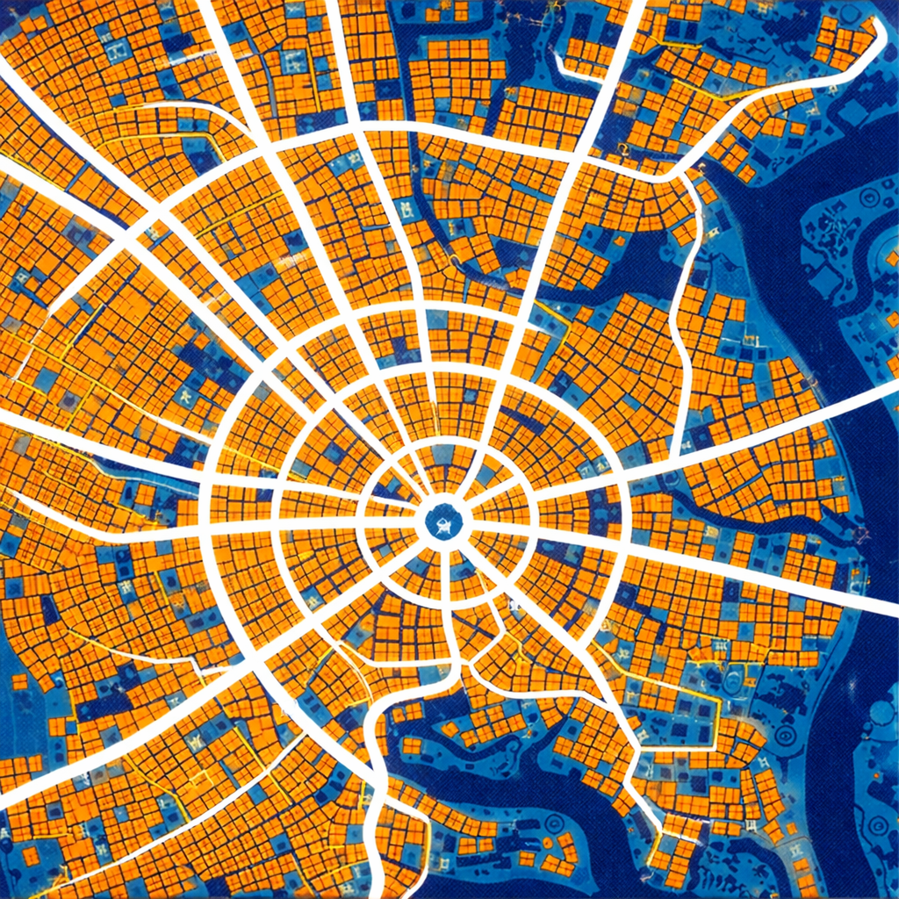
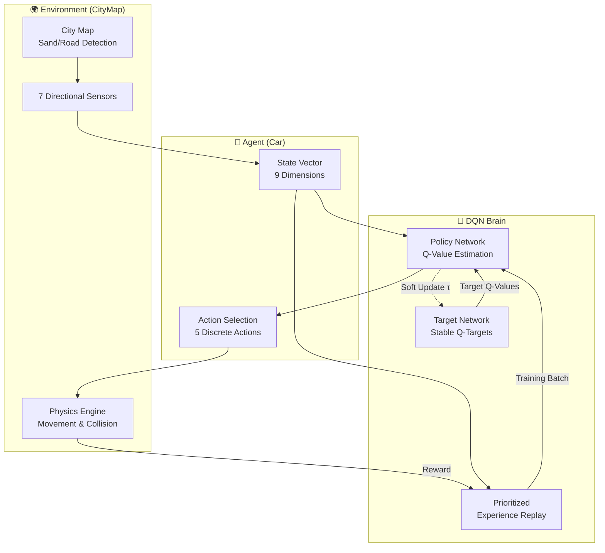
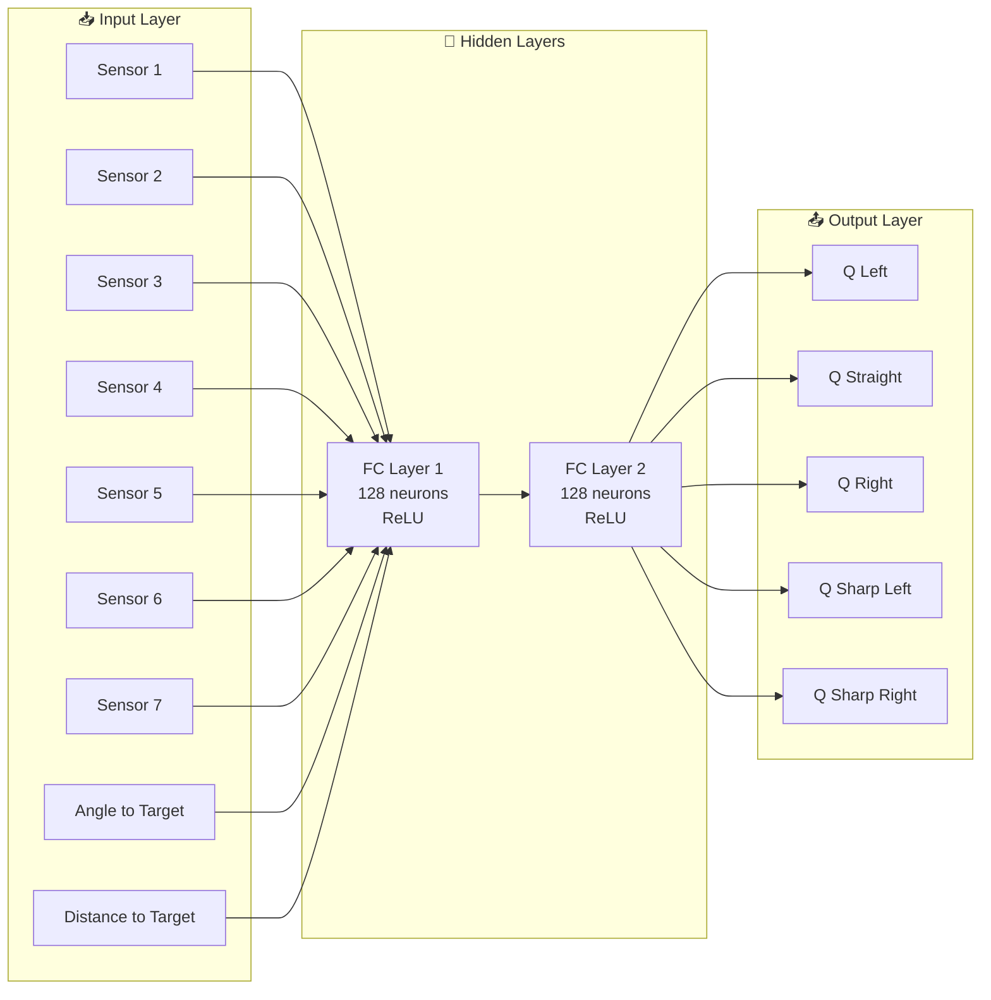
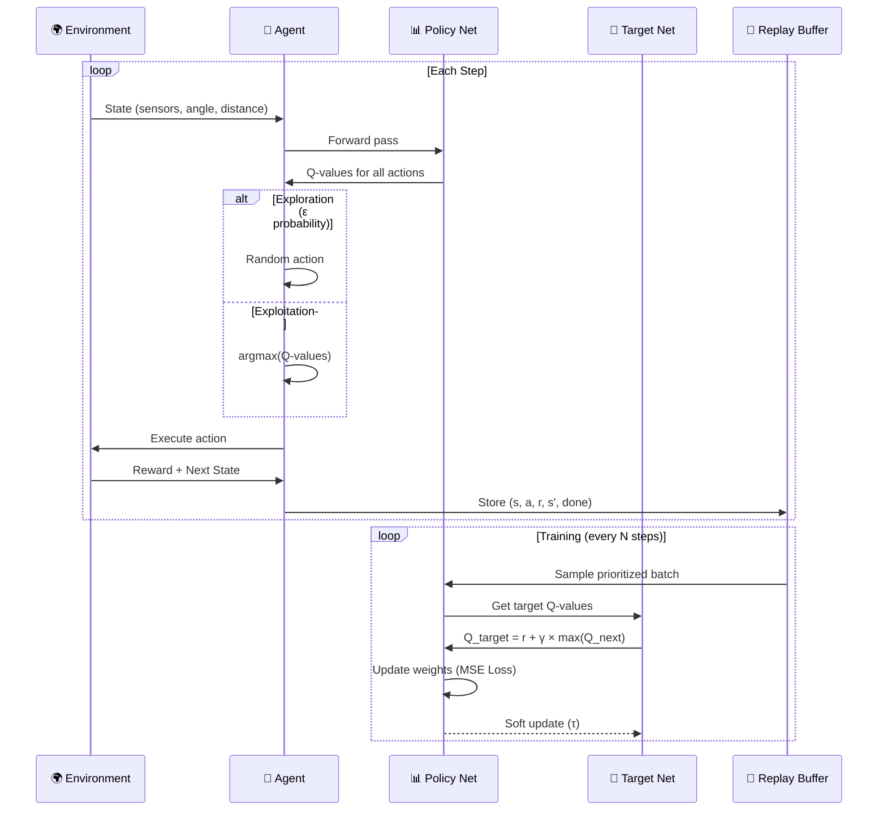
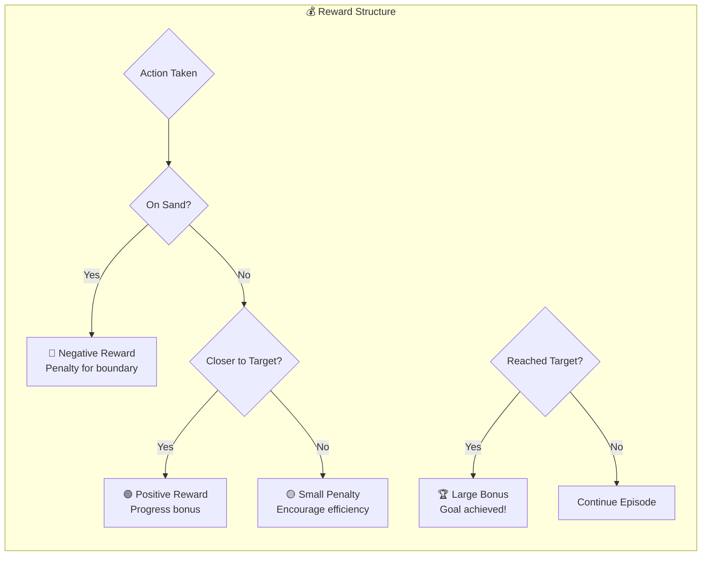

# 🚗 NeuralNav: Autonomous Car Navigation Assignment

NeuralNav is an interactive reinforcement learning simulation where a self-driving car learns to navigate a city map using a **Deep Q-Network (DQN)**. This project is designed as an educational assignment for the **TSAI ERA** program, focusing on hyperparameter tuning and understanding RL dynamics.



## 🌟 Key Features

- **Deep Q-Learning**: Implements a DQN with a target network for stable learning.
- **Prioritized Experience Replay**: A custom buffer system that prioritizes successful episodes to accelerate learning.
- **Interactive UI**: Built with PyQt6, allowing users to:
  - Load custom city maps.
  - Set car starting positions and multiple sequential targets.
  - Visualize real-time sensor data and reward history.
- **Physics Simulation**: Realistic car movement with adjustable speed, turn angles, and sensor arrays.

## 🛠️ Installation

1. **Clone the repository**:
   ```bash
   git clone <repository-url>
   cd ERAS16A2
   ```

2. **Install dependencies**:
   This project uses `PyQt6`, `torch`, and `numpy`.
   ```bash
   pip install PyQt6 torch numpy
   ```
   *Note: Using `uv` or `conda` for environment management is recommended.*

## 🚀 Usage Guide

1. **Run the application**:
   ```bash
   python citymap_assignment.py
   ```

2. **Setup the Simulation**:
   - **Step 1**: Click anywhere on the map to set the **Car's Starting Position**.
   - **Step 2**: Click on the map to set **Target(s)**. You can add multiple targets in sequence.
   - **Step 3**: **Right-click** to finalize the setup.
   - **Step 4**: Press **SPACE** or click **START** to begin the training.

3. **Controls**:
   - **RESET ALL**: Clears the map and resets the brain.
   - **LOAD MAP**: Import your own `.png` or `.jpg` city layout.
   - **PAUSE/RESUME**: Toggle the simulation loop.

## 🏗️ Architecture & Design

### System Overview



### Neural Network Architecture



### Training Loop



### Reward System



---

## 🧠 Reinforcement Learning Details

### State Space (9 Dimensions)
- **7 Sensors**: Detecting "sand" (boundaries) at various angles (-45° to 45°).
- **Angle to Target**: Normalized orientation relative to the goal.
- **Distance to Target**: Normalized Euclidean distance.

### Action Space (5 Discrete Actions)
- `0`: Left Turn
- `1`: Straight
- `2`: Right Turn
- `3`: Sharp Left
- `4`: Sharp Right

### Hyperparameters
The following parameters are critical for convergence:
- **Learning Rate (LR)**: Controls how fast the network updates.
- **Gamma ($\gamma$)**: The discount factor for future rewards.
- **Epsilon ($\epsilon$)**: The exploration rate (starts at 1.0 and decays).
- **Tau ($\tau$)**: Soft update coefficient for the target network.

## 📝 Assignment: "Fix the Parameters"

Several critical parameters in `citymap_assignment.py` are intentionally set to incorrect values. Your task is to find the `# FIX ME!` comments and set appropriate values to help the car learn effectively.

### Common Questions
- **What happens if the boundary-signal is weak?** The car will ignore the road and drive straight through "sand" to reach the target.
- **What is the effect of reducing Gamma?** The car becomes "short-sighted," focusing only on immediate rewards and failing to plan long-term paths to distant targets.
- **What does Temperature do?** While not used in this specific $\epsilon$-greedy implementation, temperature in RL controls the randomness of action selection in Softmax policies.

## 📊 Visualization
The UI includes a **Reward History Chart** showing:
- **Raw Scores**: Performance of individual episodes.
- **Moving Average (10)**: The overall learning trend (look for an upward curve!).

---
*Developed for the TSAI ERA Program.*
