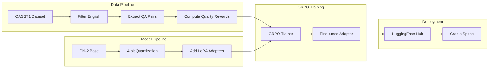
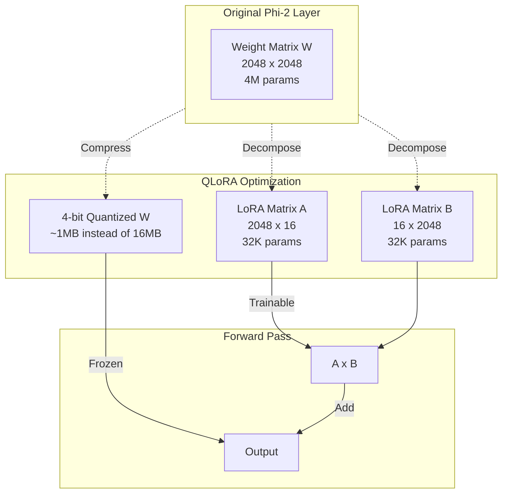
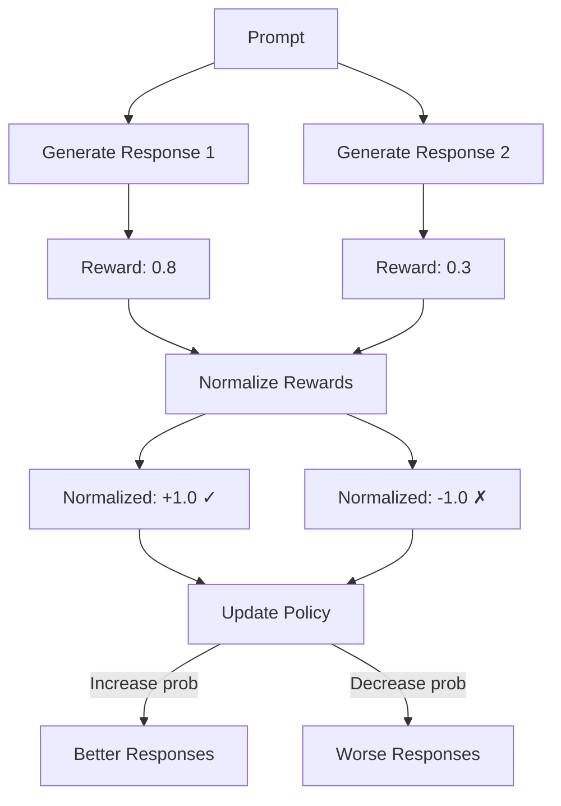
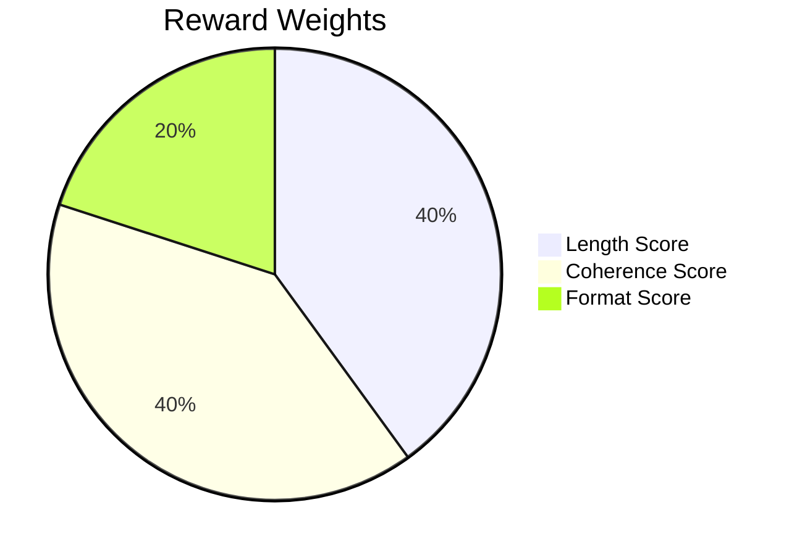
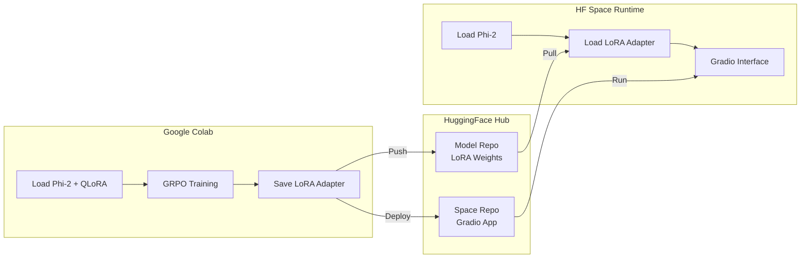
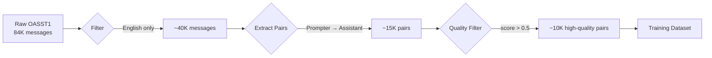
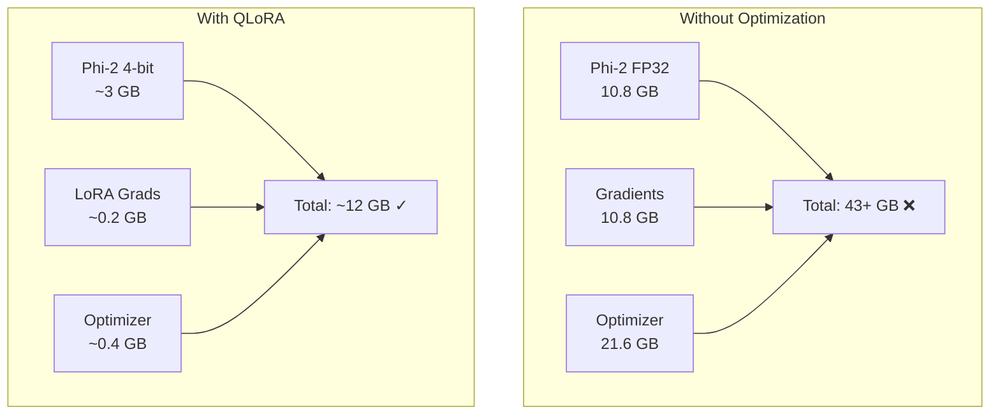
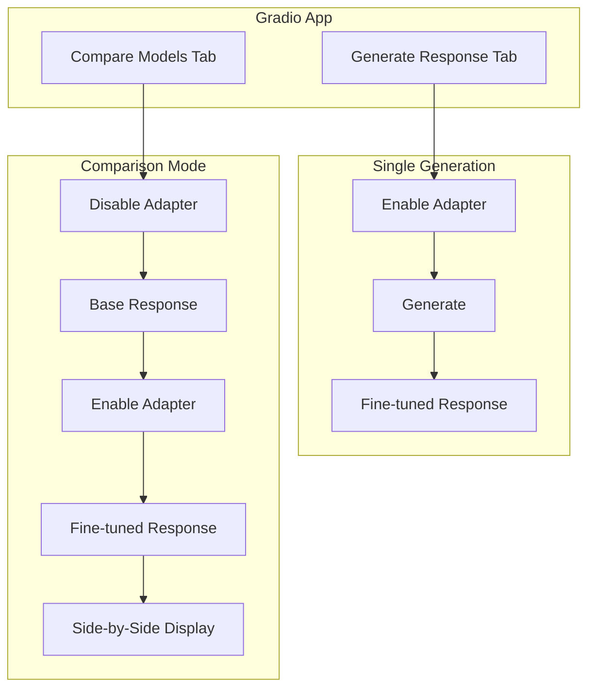
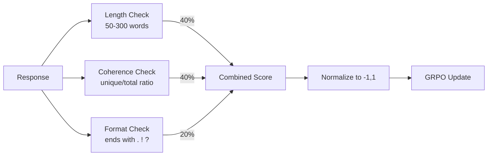

# GRPO Fine-tuning Phi-2 with QLoRA on OASST1

This project fine-tunes Microsoft's **Phi-2** model using **GRPO (Group Relative Policy Optimization)** with **QLoRA** on the **OpenAssistant/oasst1** dataset.

## Overview

- **Base Model**: [microsoft/phi-2](https://huggingface.co/microsoft/phi-2)
- **Dataset**: [OpenAssistant/oasst1](https://huggingface.co/datasets/OpenAssistant/oasst1)
- **Training Method**: GRPO (Group Relative Policy Optimization) from TRL
- **Optimization**: QLoRA (4-bit quantization + LoRA adapters)
- **Hardware**: Optimized for Google Colab Free Tier (T4 GPU)

---

## Architecture

### High-Level Training Pipeline



### QLoRA Architecture



### GRPO Training Flow



### Reward Function Components



### Deployment Architecture



---

## Files

| File | Description |
|------|-------------|
| `train_grpo.ipynb` | Main training notebook for Google Colab |
| `data_utils.py` | Dataset preprocessing utilities |
| `app.py` | Gradio app for Hugging Face Space deployment |
| `requirements.txt` | Dependencies for the HF Space |
| `LLM_FINETUNING_GUIDE.md` | Comprehensive learning guide |

---

## Quick Start

### Training (Google Colab)

1. Open `train_grpo.ipynb` in Google Colab
2. Ensure you have a T4 GPU runtime selected
3. Add your Hugging Face token to Colab Secrets (key: `HF_TOKEN`)
4. Run all cells sequentially

### Training Configuration

```python
MAX_LENGTH = 512        # Reduced sequence length
BATCH_SIZE = 2          # Small batch size
GRADIENT_ACCUMULATION = 8
NUM_GENERATIONS = 2     # GRPO generations per prompt
```

### QLoRA Configuration

```python
# 4-bit quantization
load_in_4bit=True
bnb_4bit_quant_type="nf4"
bnb_4bit_compute_dtype=torch.bfloat16
bnb_4bit_use_double_quant=True

# LoRA
r=16
lora_alpha=32
target_modules=["q_proj", "k_proj", "v_proj", "dense"]
```

---

## How It Works

### Data Flow



### Memory Optimization



---

## Deployment

After training, the notebook will:
1. Push the LoRA adapter to your Hugging Face Hub
2. Create and deploy a Gradio Space

### Manual Space Deployment

1. Create a new Space on Hugging Face (Gradio SDK)
2. Update `ADAPTER_MODEL` in `app.py` with your model repo
3. Upload `app.py` and `requirements.txt` to the Space

### App Features



---

## Reward Function

The GRPO training uses a custom reward function:



---

## Expected Results

| Metric | Value |
|--------|-------|
| Training Time | ~4-6 hours on T4 GPU |
| GPU Memory Usage | ~12-14 GB |
| Adapter Size | ~500 MB |
| Trainable Parameters | ~0.3% of total |

---

## Requirements

```
transformers>=4.36.0
trl>=0.7.0
peft>=0.7.0
bitsandbytes>=0.41.0
datasets
accelerate
gradio>=4.0.0
huggingface_hub
```

---

## References

- [TRL GRPO Trainer Documentation](https://huggingface.co/docs/trl/main/en/grpo_trainer)
- [PEFT/LoRA Documentation](https://huggingface.co/docs/peft)
- [Phi-2 Model Card](https://huggingface.co/microsoft/phi-2)
- [OASST1 Dataset](https://huggingface.co/datasets/OpenAssistant/oasst1)

---

## License

This project is for educational purposes. Please refer to the licenses of the underlying models and datasets.
